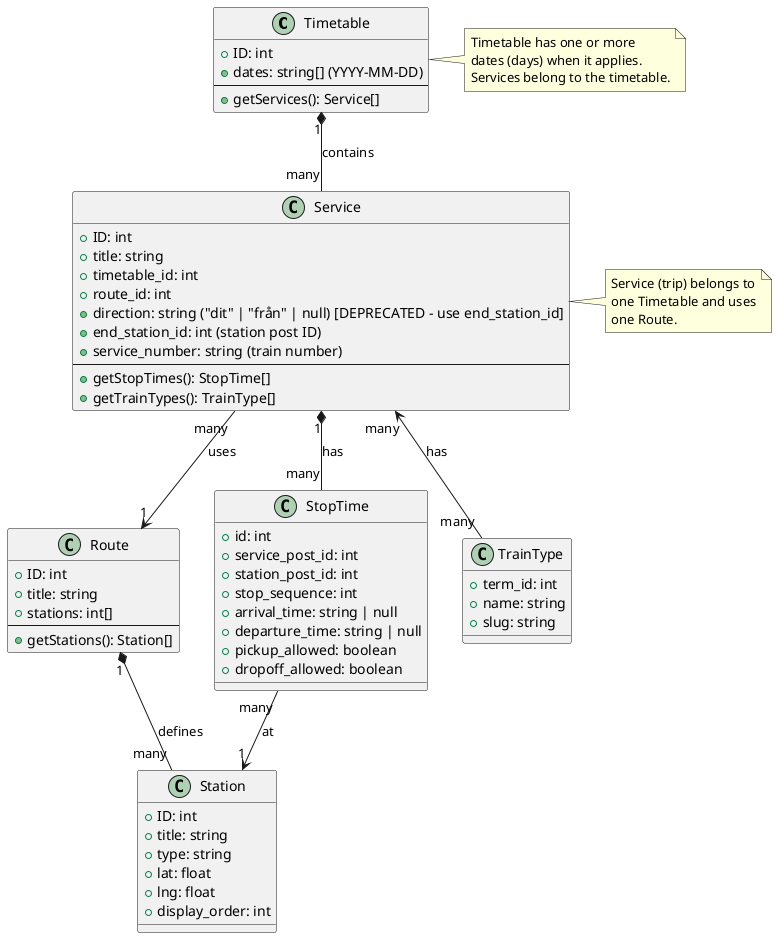

# Data Model Documentation

This document describes all data objects in the Museum Railway Timetable plugin and their relationships.

## Overview

The plugin uses a combination of WordPress Custom Post Types, Taxonomies, Custom Database Tables, and Post Meta to manage timetable data.

**New Data Model:**
- A **Timetable** has one or more dates (days) when it applies and contains multiple trips (Services)
- A **Service** (trip) belongs to one Timetable, has arrival/departure times (Stop Times), and a train type
- A **Route** defines which stations are available (independent of timetable)
- A **Station** is used in Routes and Stop Times
- **Stop Times** can have NULL times when the train stops but the time is not fixed

### UML Class Diagram



### Simplified Relationship Diagram

```
Timetable (has dates: [YYYY-MM-DD, ...])
    │
    │ 1-to-many
    │
    ▼
Service (trip) ──────► Route (defines stations)
    │
    │ 1-to-many
    │
    ▼
StopTime (times can be NULL) ──────► Station
    │
    │ many-to-many
    │
    ▼
TrainType
```

---

## 1. Custom Post Types

### 1.1 Timetable (`mrt_timetable`)

**Description:** A timetable has one or more dates (days) when it applies and contains multiple trips (services). The timetable defines the days, and services belong to the timetable.

**Storage:** WordPress `wp_posts` table (post_type = 'mrt_timetable')

**Fields:**
- **Post ID** (ID) - Unique identifier
- **Title** (post_title) - Optional, not required

**Meta Fields:**
- `mrt_timetable_dates` (array) - Array of dates in YYYY-MM-DD format (required, at least one date)
  - **The dates (days) when this timetable applies**
  - A timetable can apply to multiple days
  - Example: `["2025-06-15", "2025-06-16", "2025-06-17"]`
  - Dates are stored as an array and sorted

**Relationships:**
- **One-to-Many** with `Service` (via `mrt_service_timetable_id` meta field)
  - One timetable contains multiple services (trips)
  - **Each service belongs to one timetable** (the service has a reference to the timetable)
  - The timetable has the dates; services belong to the timetable

**Usage:**
- **Has the dates (days) when it applies** - the timetable owns the dates
- Groups multiple trips (services) that run on the same days
- Services reference the timetable (they belong to it)
- Used to query all trips for a specific date by finding timetables that include that date

---

### 1.2 Station (`mrt_station`)

**Description:** Represents a physical station, halt, depot, or museum location.

**Storage:** WordPress `wp_posts` table (post_type = 'mrt_station')

**Fields:**
- **Title** (post_title) - Station name (required)
- **Post ID** (ID) - Unique identifier

**Meta Fields:**
- `mrt_station_type` (string) - Type of station
  - Values: `'station'`, `'halt'`, `'depot'`, `'museum'`, or empty
- `mrt_lat` (float) - Latitude coordinate (optional)
- `mrt_lng` (float) - Longitude coordinate (optional)
- `mrt_display_order` (int) - Display order for sorting (default: 0)

**Relationships:**
- **Many-to-Many** with `Service` via `mrt_stoptimes` table
- Each station can have multiple stop times (different services stopping there)
- Each service can stop at multiple stations

**Usage:**
- Used in shortcodes to display timetables
- Referenced in `mrt_stoptimes.station_post_id`

---

### 1.3 Service (`mrt_service`)

**Description:** Represents a single train trip. A service (trip) belongs to one timetable and has arrival/departure times at stations. The service does not have the date - it belongs to a timetable which has the date.

**Storage:** WordPress `wp_posts` table (post_type = 'mrt_service')

**Fields:**
- **Title** (post_title) - Service/trip name (required)
  - Example: "09:00 Departure", "Morning Express", "Steam Train Tour"
- **Post ID** (ID) - Unique identifier

**Meta Fields:**
- `mrt_service_timetable_id` (int) - Timetable post ID that this service belongs to (required)
  - **Links service to a timetable - the service belongs to the timetable**
  - The timetable has the date; the service references the timetable
  - Each service belongs to exactly one timetable
- `mrt_service_route_id` (int) - Route post ID that this service runs on (required)
  - Links service to a route
  - Used to filter available stations when configuring stop times
  - Multiple services can use the same route
- `mrt_direction` (string) - Direction of the service (optional, deprecated - use `mrt_service_end_station_id` instead)
  - Allowed values: `'dit'` or `'från'`
  - Empty string if not set
  - Example: "dit" (towards), "från" (from)
  - **Note**: This field is kept for backward compatibility. New services should use `mrt_service_end_station_id` instead.
- `mrt_service_end_station_id` (int) - End station (destination) post ID (optional, recommended)
  - References a Station post ID
  - Used to determine the destination/end station of the service
  - Takes precedence over `mrt_direction` if set
  - Example: 123 (station post ID)
- `mrt_service_number` (string) - Train number displayed in timetables (optional)
  - Train number as displayed to users (e.g., "71", "91", "73")
  - If empty, service ID is used as fallback
  - Example: "71", "91", "73"

**Taxonomies:**
- `mrt_train_type` - Train type taxonomy (many-to-many)
  - Links service to train types (e.g., "steam", "diesel", "electric")
  - A service can have multiple train types

**Relationships:**
- **Many-to-One** with `Timetable` (via `mrt_service_timetable_id` meta field)
  - **Each service belongs to one timetable** - the service references the timetable
  - The timetable has the date; services belong to the timetable
  - One timetable contains multiple services (trips)
- **Many-to-One** with `Route` (via `mrt_service_route_id` meta field)
  - Each service uses one route
  - Multiple services can use the same route
- **One-to-Many** with `StopTime` (via `mrt_stoptimes.service_post_id`)
  - One service has multiple stop times (one per station where it stops)
- **Many-to-Many** with `Station` (via `mrt_stoptimes` table)
  - A service stops at multiple stations
  - A station is served by multiple services
- **Many-to-Many** with `TrainType` (via taxonomy)
  - A service can have multiple train types
  - A train type can be assigned to multiple services

**Usage:**
- Represents one trip
- **Belongs to a timetable** (which has the date)
- Defines which stations the train stops at and when (via Stop Times)
- Can be filtered by train type in shortcodes

---

### 1.4 Route (`mrt_route`)

**Description:** Defines a route (line) with a sequence of stations. Routes are used to organize services and simplify stop time configuration.

**Storage:** WordPress `wp_posts` table (post_type = 'mrt_route')

**Fields:**
- **Title** (post_title) - Route name (required)
  - Example: "Hultsfred → Västervik", "Main Line", "Northbound"
- **Post ID** (ID) - Unique identifier

**Meta Fields:**
- `mrt_route_stations` (array) - Array of station post IDs in order
  - Defines which stations are on the route and their sequence
  - Example: `[123, 456, 789]` means station 123 is first, 456 is second, etc.

**Relationships:**
- **One-to-Many** with `Service` (via `mrt_service_route_id` meta field)
  - Multiple services can use the same route
  - Each service uses one route
  - Routes are independent of timetables - they just define which stations are available

**Usage:**
- Defines which stations are on a route and their order
- Used in Service edit screen to automatically display all stations on the route
- Simplifies stop time configuration - user selects which stations the train stops at
- Routes can be reused for multiple services across different timetables
- Routes can work in both directions (create separate routes for each direction if needed)

---

## 2. Taxonomies

### 2.1 Train Type (`mrt_train_type`)

**Description:** Categorizes services by train type (e.g., steam, diesel, electric).

**Storage:** WordPress taxonomy tables (`wp_terms`, `wp_term_taxonomy`, `wp_term_relationships`)

**Fields:**
- **Name** (term name) - Train type name (required)
- **Slug** (term slug) - URL-friendly identifier (auto-generated)
- **Term ID** - Unique identifier

**Relationships:**
- **Many-to-Many** with `Service` (via WordPress taxonomy system)
  - One service can have multiple train types
  - One train type can be assigned to multiple services

**Usage:**
- Used to filter services in shortcodes (`train_type` parameter)
- Used in admin interface for filtering stations overview
- Displayed in timetable views

**Example Values:**
- "steam"
- "diesel"
- "electric"
- "heritage"

---

## 3. Custom Database Tables

### 3.1 Stop Times (`{prefix}_mrt_stoptimes`)

**Description:** Stores the schedule of when services stop at stations, including arrival/departure times and sequence.

**Table Structure:**
```sql
CREATE TABLE {prefix}_mrt_stoptimes (
    id BIGINT UNSIGNED NOT NULL AUTO_INCREMENT,
    service_post_id BIGINT UNSIGNED NOT NULL,
    station_post_id BIGINT UNSIGNED NOT NULL,
    stop_sequence INT NOT NULL,
    arrival_time CHAR(5) NULL,
    departure_time CHAR(5) NULL,
    pickup_allowed TINYINT(1) DEFAULT 1,
    dropoff_allowed TINYINT(1) DEFAULT 1,
    PRIMARY KEY (id),
    KEY service_seq (service_post_id, stop_sequence),
    KEY station (station_post_id)
)
```

**Fields:**
- `id` (BIGINT) - Primary key, auto-increment
- `service_post_id` (BIGINT) - Foreign key to `wp_posts.ID` (mrt_service)
- `station_post_id` (BIGINT) - Foreign key to `wp_posts.ID` (mrt_station)
- `stop_sequence` (INT) - Order of stop in service route (1, 2, 3, ...)
- `arrival_time` (CHAR(5)) - Arrival time in HH:MM format (nullable)
  - Can be NULL if the train stops but the time is not fixed
  - Example: "09:15" or NULL
- `departure_time` (CHAR(5)) - Departure time in HH:MM format (nullable)
  - Can be NULL if the train stops but the time is not fixed
  - Example: "09:20" or NULL
- `pickup_allowed` (TINYINT) - Whether passengers can board (default: 1)
- `dropoff_allowed` (TINYINT) - Whether passengers can alight (default: 1)

**Relationships:**
- **Many-to-One** with `Service` (via `service_post_id`)
- **Many-to-One** with `Station` (via `station_post_id`)

**Indexes:**
- Primary key on `id`
- Composite index on `(service_post_id, stop_sequence)` for efficient service route queries
- Index on `station_post_id` for efficient station queries

**Usage:**
- Core table for timetable functionality
- Used by shortcodes to display departure/arrival times
- Created via admin interface

**Example Data:**
```
service_post_id | station_post_id | stop_sequence | arrival_time | departure_time
----------------|-----------------|---------------|--------------|----------------
123            | 45              | 1             | NULL         | 09:00
123            | 46              | 2             | 09:15        | 09:20
123            | 47              | 3             | 09:35        | NULL
```

---

**Note:** The `mrt_calendar` table has been removed. Services are now linked directly to Timetables (which represent specific days).

---

## 4. WordPress Options

### 4.1 Plugin Settings (`mrt_settings`)

**Description:** Stores plugin configuration options.

**Storage:** WordPress `wp_options` table

**Structure:**
```php
[
    'enabled' => bool,  // Whether plugin is enabled
    'note' => string   // Optional note/notice text
]
```

**Default Values:**
```php
[
    'enabled' => true,
    'note' => ''
]
```

**Usage:**
- Controls whether timetable functionality is active
- Stores optional note text for display

---

## 5. Data Relationships Summary

### Primary Relationships

1. **Timetable → Service** (One-to-Many)
   - Via: `mrt_service_timetable_id` meta field
   - **Timetable has the date (day) when it applies**
   - **Service belongs to the timetable** (service references timetable)
   - One timetable contains multiple services (trips)
   - Each service belongs to one timetable

2. **Service → Route** (Many-to-One)
   - Via: `mrt_service_route_id` meta field
   - Each service uses one route
   - Multiple services can use the same route

3. **Service ↔ Station** (Many-to-Many)
   - Via: `mrt_stoptimes` table
   - A service stops at multiple stations
   - A station is served by multiple services

4. **Service → StopTime** (One-to-Many)
   - Via: `mrt_stoptimes.service_post_id`
   - One service has multiple stop times (one per station where it stops)

5. **Station → StopTime** (One-to-Many)
   - Via: `mrt_stoptimes.station_post_id`
   - One station has multiple stop times (from different services)

6. **Service ↔ TrainType** (Many-to-Many)
   - Via: WordPress taxonomy system
   - A service can have multiple train types
   - A train type can be assigned to multiple services

7. **Route → Station** (One-to-Many, via meta field)
   - Via: `mrt_route_stations` meta field (array)
   - A route defines which stations are available and their order
   - Stations can be used in multiple routes

### Query Patterns

**Find all services stopping at a station:**
```sql
SELECT DISTINCT service_post_id 
FROM mrt_stoptimes 
WHERE station_post_id = {station_id}
```

**Find all stations for a service:**
```sql
SELECT station_post_id, stop_sequence, arrival_time, departure_time
FROM mrt_stoptimes
WHERE service_post_id = {service_id}
ORDER BY stop_sequence
```

**Find all services (trips) for a specific date (timetable):**
```sql
-- Note: This requires checking if the date exists in the timetable's dates array
-- In WordPress, this is typically done via PHP by:
-- 1. Finding all timetables where the date is in mrt_timetable_dates array
-- 2. Finding all services linked to those timetables

SELECT p.ID
FROM wp_posts p
INNER JOIN wp_postmeta pm ON p.ID = pm.post_id
WHERE p.post_type = 'mrt_service'
  AND pm.meta_key = 'mrt_service_timetable_id'
  AND pm.meta_value IN (
    SELECT t.ID
    FROM wp_posts t
    INNER JOIN wp_postmeta tm ON t.ID = tm.post_id
    WHERE t.post_type = 'mrt_timetable'
      AND tm.meta_key = 'mrt_timetable_dates'
      AND tm.meta_value LIKE '%{date}%'  -- Note: Array search in meta_value
  )
```

---

## 6. Data Flow

### Data Creation Flow
1. **Stations** → Created via admin interface (`mrt_station` posts with meta fields)
2. **Routes** → Created via admin interface (`mrt_route` posts with station sequence)
3. **Timetables** → Created via admin interface (`mrt_timetable` posts with dates array)
4. **Services** → Created via admin interface (`mrt_service` posts linked to timetable and route)
   - Can be created directly from Timetable edit screen (recommended workflow)
   - Automatically named based on Route + Direction
5. **Stop Times** → Created via admin interface (inserts into `mrt_stoptimes` table)

### Timetable Overview View

The plugin provides a visual overview of timetables that groups services (trips) by route and direction, similar to traditional printed timetables. This view:

- **Groups trips** by route and direction (e.g., "Från Uppsala Ö Till Marielund")
- **Displays train types** (Ångtåg, Rälsbuss, Dieseltåg) for each trip
- **Shows times** for each station, with "X" indicating null/unspecified times
- **Available in admin** as a preview meta box on Timetable edit screens
- **Rendered by** `MRT_render_timetable_overview()` function in `inc/functions/timetable-view.php`

### Display Flow
1. **Shortcode** → Queries timetables for a specific date
2. **Timetable Query** → Finds timetable(s) for the date
3. **Service Query** → Gets all services (trips) belonging to the timetable
4. **Stop Time Query** → Gets stops from `mrt_stoptimes` for each service
5. **Station Lookup** → Gets station details from `mrt_station` posts
6. **Train Type Filter** → Filters via taxonomy if specified

---

## 7. Key Functions

### Helper Functions
- `MRT_get_all_stations()` - Get all stations ordered by display order
- `MRT_get_post_by_title()` - Find post by title and type
- `MRT_get_current_datetime()` - Get current date/time info

### Service Functions
- `MRT_services_running_on_date()` - Find services active on a date
- `MRT_get_services_for_station()` - Get services stopping at station
- `MRT_next_running_day_for_station()` - Find next service day for station


---

## 8. Data Integrity

### Constraints
- **Stop Times**: `service_post_id` and `station_post_id` must reference valid posts
- **Stop Sequence**: Must be unique per service (enforced in application logic)

### Validation
- Time formats: HH:MM (24-hour format)
- Date formats: YYYY-MM-DD
- Station types: Whitelist validation (station, halt, depot, museum)
- Display order: Integer >= 0

---

## 9. Future Considerations

### Planned Features

#### 9.1 Ersättningstur/Tågtyp (Substitute Trip/Train Type)
**Description:** Möjlighet att definiera ersättningsturer eller alternativa tågtyper när en service inte kan köras som planerat.

**Potential Implementation:**
- Lägg till meta field `mrt_service_substitute_service_id` för att länka till en ersättningstur
- Lägg till meta field `mrt_service_substitute_train_type` för att ange alternativ tågtyp
- Admin-gränssnitt för att konfigurera ersättningar
- Shortcode-parameter för att visa ersättningar i tidtabeller
- Notifiering när en service har en aktiv ersättning

**Use Cases:**
- När ett ånglok inte kan köras, ersätt med diesellok
- När en service är inställd, visa alternativ service
- Planera underhåll med automatisk ersättning

---

#### 9.2 Reseplanerare (Journey Planner)
**Description:** Funktion för att planera resor mellan stationer med anslutningar och rekommendationer.

**Potential Implementation:**
- Ny shortcode: `[mrt_journey_planner]` med parametrar för startstation, slutstation, datum, tid
- Algoritm för att hitta rutter med anslutningar
- Beräkning av restid och antal byten
- Visning av anslutningstider och varningar för korta anslutningar
- Filtrering baserat på tågtyp (t.ex. endast ånglok)

**Use Cases:**
- Besökare vill resa från Station A till Station B
- Hitta alla möjliga rutter för en dag
- Visa snabbaste resväg eller mest sceniska rutt
- Planera dagsturer med flera stopp

---

#### 9.3 Samankopplade Rutter (Connected Routes)
**Description:** Möjlighet att länka rutter tillsammans för att skapa längre resvägar och förenkla reseplanering.

**Potential Implementation:**
- Ny meta field `mrt_route_connected_routes` (array av route IDs)
- Definition av anslutningsstationer mellan rutter
- Automatisk beräkning av anslutningstider
- Visning av sammanhängande ruttnätverk i admin-gränssnittet
- Integration med reseplanerare för att hitta rutter via anslutningar

**Use Cases:**
- Route A går från Station 1 → Station 5
- Route B går från Station 5 → Station 10
- Systemet kan automatiskt föreslå anslutning vid Station 5
- Skapa längre resvägar genom att kombinera flera rutter
- Visualisera hela ruttnätverket på en karta

---

### Other Potential Enhancements
- **Station Meta**: Could add more location data (address, facilities, etc.)
- **Service Meta**: Could add more service details (capacity, amenities, etc.)
- **Caching**: Transient caching for expensive queries (station lists, service lookups)
- **Real-time Updates**: Integration med realtidsdata för förseningar och ändringar

---

## 10. Database Schema Diagram

```
wp_posts (mrt_timetable)
    ├─ ID (PK)
    ├─ post_title (optional, not required)
    └─ post_type = 'mrt_timetable'
        └─ wp_postmeta
            └─ mrt_timetable_dates (array of YYYY-MM-DD dates)

wp_posts (mrt_station)
    ├─ ID (PK)
    ├─ post_title
    └─ post_type = 'mrt_station'
        └─ wp_postmeta
            ├─ mrt_station_type
            ├─ mrt_lat
            ├─ mrt_lng
            └─ mrt_display_order

wp_posts (mrt_route)
    ├─ ID (PK)
    ├─ post_title
    └─ post_type = 'mrt_route'
        └─ wp_postmeta
            └─ mrt_route_stations (array of station IDs)

wp_posts (mrt_service)
    ├─ ID (PK)
    ├─ post_title
    └─ post_type = 'mrt_service'
        └─ wp_postmeta
            ├─ mrt_service_timetable_id (FK → mrt_timetable.ID)
            ├─ mrt_service_route_id (FK → mrt_route.ID)
            └─ mrt_direction
        └─ wp_term_relationships
            └─ mrt_train_type (taxonomy)

{prefix}_mrt_stoptimes
    ├─ id (PK)
    ├─ service_post_id (FK → wp_posts.ID, mrt_service)
    ├─ station_post_id (FK → wp_posts.ID, mrt_station)
    ├─ stop_sequence
    ├─ arrival_time
    ├─ departure_time
    ├─ pickup_allowed
    └─ dropoff_allowed

wp_terms (mrt_train_type)
    ├─ term_id (PK)
    ├─ name
    └─ slug
        └─ wp_term_relationships
            └─ object_id → wp_posts.ID (mrt_service)
```

---

*Last updated: Based on current codebase structure*

