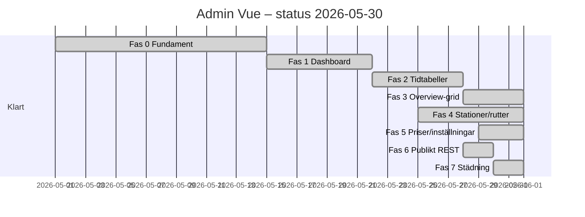

# Admin Vue – plan och faser

> **Status 2026-05:** Alla faser 0–7 är **klara**. Detta dokument är arkiverad referens (beslut, REST-karta, genomförd städning). Daglig utveckling: [ADMIN_WORKFLOW.md](ADMIN_WORKFLOW.md), [REST_API.md](REST_API.md).

Ersätter WordPress CPT/meta box-admin med en **Vue-app** under **Railway Timetable**. Datamodellen (CPT, meta, `mrt_stoptimes`) behålls; UI och API byts ut.

**Relaterat:** [REST_API.md](REST_API.md), [ADMIN_WORKFLOW.md](ADMIN_WORKFLOW.md), [VUE_FRONTEND.md](VUE_FRONTEND.md).

**Senast uppdaterad:** 2026-05-30 (admin-list borttagen, docs synk, mobil dashboard/lista).

---

## Statusöversikt

| Fas | Status | Kommentar |
|-----|--------|-----------|
| **0** Fundament | ✅ Klar | REST loader, admin shell, `adminRest.ts`, meny, policy |
| **1** Dashboard | ✅ Klar | Stats, varningar, snabbstart, länkar |
| **2** Tidtabeller | ✅ Klar | Lista, editor (datum/turer/stopptider/avvikelser/preview) |
| **3** Stopptider i overview | ✅ Klar | Editable grid i Stopptider-fliken; tabellvy kvar som fallback |
| **4** Stationer & rutter | ✅ Klar | `StationsRoutesPage`, tågtyper, `RoutePreview` |
| **5** Priser & inställningar | ✅ Klar | Vue + REST; CSV via `ImportExportPage` |
| **6** Publikt REST | ✅ Klar | Wizard/month/overview via `mrtRest.ts`; AJAX borttaget |
| **7** Städning | ✅ Klar | Legacy jQuery + PHP dashboard/settings borttagna; dev-verktyg via REST |

**Kvar (valfritt):** utökad mobil-UX på stationer/rutter och inställningar (dashboard, lista och tidtabellseditor har mobilvy).

---

## Låsta produktbeslut (2026-05)

| # | Beslut |
|---|--------|
| 1 | **Ersätta** — Vue-admin blir enda vägen; CPT-skärmar redirectas |
| 2 | **REST only** — ✅ uppnått 2026-05-30. Ingen `admin-ajax.php` / `wp_ajax_mrt_*` kvar. Se [REST_API.md](REST_API.md) |
| 3 | **Första leverans:** Dashboard (Vue) — minimal: statistik, varningar, snabbstart, länkar |
| 4 | **Design:** WordPress-native skal (`wrap`, `button`, `notice`, `nav-tab-wrapper`) + Vue-innehåll |
| 5 | **Responsivitet:** Desktop-first; mobil: avvikelser + snabb ändring av en avgångstid |
| 6 | **Behörighet:** `manage_options` = fullt; `edit_posts` = begränsat skriv (avvikelser/inställt, ej grunddata) |
| 7 | **Routing:** Hash i wp-admin (`#/dashboard`, `#/timetables/123`) |
| 8 | **Sparbeteende:** Hybrid — auto-save små fält, explicit Spara för stopptider/import |
| 9 | **Efter dashboard:** Full tidtabellsredigerare före mobil-fokus |
| 10 | **Varningar:** Informativa only — blockerar inte publicering |
| 11 | **Legacy URL:** Redirect till Vue-route när mappning finns |
| 12 | **Build:** Separat Vite entry `admin.js` (`vite.admin.config.ts`) |
| 13 | **Språk:** Svenska primärt i UI |
| 14 | **E2E:** Playwright — publikt från Fas 2; admin dashboard tillagt i Fas 7 |

---

## Behörigheter (detalj)

| Roll / capability | Dashboard | Grunddata (station/rutt/tidtabell) | Avvikelser / inställt | Stopptider | Import/priser |
|-------------------|-----------|-----------------------------------|------------------------|------------|---------------|
| `manage_options` | Full | Full | Full | Full | Full |
| `edit_posts` | Read + begränsat skriv | Read-only | **Skriv** | **En avgångstid** (mobil) | Read-only |

REST: varje route har `permission_callback` som speglar tabellen ovan. Ny capability `mrt_manage_timetable` **införs inte** i v1.

---

## Nuvarande navigation (implementerat)

```
Railway Timetable                    ← admin.php?page=mrt_app (Vue shell)
├── Dashboard                        ← #/dashboard
├── Tidtabeller                      ← #/timetables, #/timetables/{id}
├── Stationer & rutter               ← #/stations-routes
├── Inställningar                    ← #/settings (manage_options)
├── Priser                           ← #/prices (manage_options)
├── Tågtyper                         ← #/train-types (manage_options)
├── Import / export                  ← #/import-export (manage_options)
└── Dev tools (dev-läge)             ← #/dev-tools
```

Legacy `?page=mrt_settings` redirectar till Vue dashboard eller dev-tools. CPT-listor och `post.php`-skärmar **redirectar** till Vue (inkl. `mrt_service` → tidtabellseditor, se `inc/admin/app.php`).

---

## Teknisk nuläge

### PHP — REST (`inc/infrastructure/rest/`)

| Fil | Routes |
|-----|--------|
| `loader.php` | Registrerar alla |
| `permissions.php` | `MRT_rest_can_*`, publikt nonce |
| `dashboard.php` | `GET /dashboard` |
| `timetables.php` + `timetables-data.php` | Tidtabeller, turer, avvikelser, overview |
| `stations-routes.php` | Stationer, rutter |
| `stop-times.php` | `GET|PUT /services/{id}/stop-times`, snabb avgång |
| `settings-admin.php` | `GET|PATCH /settings`, `/settings/prices` |
| `train-types.php` | `GET|POST /train-types`, `PATCH|DELETE /train-types/{id}` |
| `import-export.php` | `POST /import/csv`, `GET /export/csv` |
| `dev-tools.php` | `POST /dev/clear-db`, `/dev/import-lennakatten`, `/dev/demo-page`, `/dev/setup-navigation`, `/dev/sync-timetable-pages` (dev-läge) |
| `journey-public.php` | Wizard/month: search, calendar, connection-detail, `GET /timetables/day` |

Domänlogik i `inc/domain/` — REST-controllers är tunna adapters.

**Borttaget:** `inc/infrastructure/ajax/` (hela lagret).

### PHP — Admin

| Fil | Syfte |
|-----|--------|
| `inc/admin/app.php` | Mount `#mrt-admin-app`, legacy redirects |
| `inc/admin/menu.php` | Vue-undermenyer + legacy `mrt_settings`-redirect |
| `inc/assets/admin-vue.php` | Enqueue `assets/dist/vue/assets/admin.js` |
| `inc/admin/meta-boxes.php` | Endast save-hooks + CPT editor-support (ingen meta box-UI) |

### Vue admin (`frontend/vue/src/admin/`)

| Fil | Status |
|-----|--------|
| `main-admin.ts`, `AdminApp.vue`, `router.ts` | ✅ |
| `api/adminRest.ts` | ✅ |
| `pages/DashboardPage.vue` | ✅ |
| `pages/TimetableListPage.vue`, `TimetableEditorPage.vue` | ✅ |
| `pages/StationsRoutesPage.vue` | ✅ |
| `pages/SettingsPage.vue`, `PricesPage.vue` | ✅ |
| `components/StopTimesEditor.vue` | ✅ tabell (inte overview-grid) |
| `pages/TrainTypesPage.vue` | ✅ |
| `pages/ImportExportPage.vue` | ✅ |
| `components/EditableTimetableOverview.vue` | ✅ overview-grid (admin) |
| `components/RoutePreview.vue` | ✅ visuell stationskedja (rutter) |

### Vue publikt

| Fil | Status |
|-----|--------|
| `api/mrtRest.ts` | ✅ REST-klient (ersätter AJAX) |
| `composables/useMrtAjax.ts` | ✅ wrapper kring `mrtRestRequest` |

**Build:** `vite build` → `main.js`; `vite build --config vite.admin.config.ts` → `admin.js`.

---

## Fas 0 – Fundament ✅

| Leverans | Status |
|----------|--------|
| REST loader + dashboard route | ✅ |
| `adminRest.ts` | ✅ |
| Admin enqueue + mount | ✅ |
| Meny + hash routing | ✅ |
| [REST_API.md](REST_API.md), [REBUILD_RULES.md](REBUILD_RULES.md) | ✅ |

---

## Fas 1 – Dashboard ✅

### Innehåll

| Block | Status |
|-------|--------|
| Status (antal entiteter) | ✅ |
| Varningar (datakvalitet) | ✅ |
| Snabbstart + länkar | ✅ |
| Nästa trafik | ✅ i REST + `DashboardPage` |
| Dev-only verktyg | ✅ Vue `#/dev-tools` + REST `/dev/*` |

### REST

- `GET /museum-railway-timetable/v1/dashboard` → `{ stats, warnings[], next_traffic[], links{} }`

### Acceptance

- [x] Dashboard laddas som Railway Timetable-startvy
- [x] Inga AJAX-anrop
- [x] Varningar med deep links till Vue-editor
- [x] Dev-verktyg bara i dev-läge via Vue `#/dev-tools`
- [x] PHPUnit `DashboardDataTest`
- [x] Vitest `dashboardPage.test.ts` (REST-klient)

---

## Fas 2 – Tidtabeller ✅

| Leverans | Status |
|----------|--------|
| Lista, skapa ny | ✅ |
| Editor: Trafikdagar, Turer, Stopptider, Avvikelser, Preview | ✅ |
| Preview (`MrtTimetableOverviewView`) | ✅ |
| REST CRUD | ✅ |

---

## Fas 3 – Stopptider i overview ✅

| Leverans | Status |
|----------|--------|
| Editable overview-grid (klick cell → tid / stannar / P-A) | ✅ |
| Tabell-`StopTimesEditor` per tur | ✅ (fallback) |
| REST `PUT /services/{id}/stop-times` | ✅ |
| Ta bort jQuery `admin-stoptimes-ui.js` | ✅ borttagen |

---

## Fas 4 – Stationer, rutter, tågtyper ✅

| Leverans | Status |
|----------|--------|
| Samlad skärm stationer + rutter | ✅ |
| Drag-ordning stationer på rutt | ✅ |
| Route preview (visuell kedja) | ✅ `RoutePreview.vue` |
| Train types CRUD + ikon-slug | ✅ `TrainTypesPage.vue` |

---

## Fas 5 – Priser, import/export, inställningar ✅

| Leverans | Status |
|----------|--------|
| Priser i Vue (`PricesPage`) | ✅ |
| Inställningar (`SettingsPage`: enabled, note, transfer-tider) | ✅ |
| REST `GET|PATCH /settings`, `/settings/prices` | ✅ |
| CSV upload + export via REST | ✅ |
| `ImportExportPage.vue` | ✅ |
| Legacy PHP CSV-meny | ✅ borttagen |

---

## Fas 6 – Publikt REST + AJAX-borttagning ✅

| Leverans | Status |
|----------|--------|
| Wizard/month/overview → `mrtRest.ts` | ✅ |
| Radera `inc/infrastructure/ajax/` | ✅ |
| Sluta lokalisera `ajaxurl` | ✅ |
| jQuery admin **ej längre enqueued** | ✅ |
| Fysisk radering `assets/admin-*.js` | ✅ |
| Meta box renderers borttagna | ✅ (save-hooks kvar) |

---

## Fas 7 – Städning ✅

| Leverans | Status |
|----------|--------|
| Meta box-UI borttaget | ✅ |
| Redirect legacy CPT-URL:er | ✅ |
| [ADMIN_WORKFLOW.md](ADMIN_WORKFLOW.md) uppdaterad | ✅ |
| E2E Playwright admin (`e2e/admin-dashboard.spec.ts`) | ✅ |
| E2E admin i CI (`scripts/ci-e2e-wp.sh`) | ✅ |
| Radera oanvända `assets/admin-*.js` | ✅ |
| Uppdatera [ARCHITECTURE.md](ARCHITECTURE.md), [STYLE_GUIDE.md](STYLE_GUIDE.md) | ✅ |
| Vitest admin (`dashboardPage.test.ts`, `routePreview.test.ts`) | ✅ |

Verifiering: `grep wp_ajax_mrt` i repo → **tomt** ✅

---

## Mobil (desktop-first)

| Skärm | Desktop | Mobil |
|-------|---------|-------|
| Dashboard | Full | Read-only status + varningar |
| Tidtabellseditor | Alla flikar | **Avvikelser** + **snabb avgångstid** (`MobileTimetablePanel`) |
| Stopptidsgrid | Full redigering | Dold (desktop-flikar) |
| Stationer/rutter | Full | Read-only via nav |
| Dev-verktyg | `#/dev-tools` (dev-läge) | Samma |

---

## Testplan

| Område | Automatiskt | Manuellt |
|--------|-------------|----------|
| Dashboard REST | PHPUnit `DashboardDataTest` | Docker: `?page=mrt_app` |
| Journey parse | PHPUnit `JourneyAjaxParseTest` | Wizard smoke |
| Publikt REST | Vitest `mrtApi.test.ts` (REST) | Month/overview shortcodes |
| Admin | Playwright `admin-dashboard.spec.ts` (CI via `ci-e2e-wp.sh`) | Skapa tidtabell, tur, preview |
| Route preview | Vitest `routePreview.test.ts` | Stationer & rutter-skärmen |
| Fas 3 grid | Vitest overview-grid | Redigera tid i grid, preview matchar |
| Slutstäd | `grep wp_ajax_mrt` tomt | [SMOKE_CHECKLIST.md](SMOKE_CHECKLIST.md) |

---

## Kvar att göra (valfritt)

1. **Mobil** — fler redigeringsfält i mobil-läge (dashboard + listor förbättrade 2026-05-30)
2. **E2E** — full tidtabellsredigering (skapa tur, spara stopptid)

---

## Tidslinje (uppdaterad)


