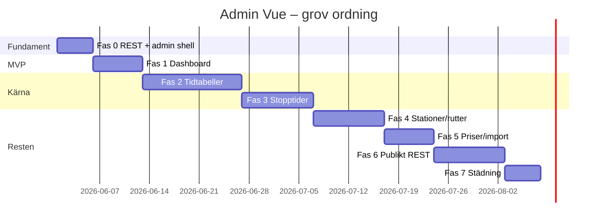

# Admin Vue – plan och faser

Ersätter WordPress CPT/meta box-admin med en **Vue-app** under **Railway Timetable**. Datamodellen (CPT, meta, `mrt_stoptimes`) behålls; UI och API byts ut.

**Relaterat:** [REST_API.md](REST_API.md) (ingen AJAX i slutläge), [ADMIN_WORKFLOW.md](ADMIN_WORKFLOW.md) (dagens manuella flöde), [VUE_FRONTEND.md](VUE_FRONTEND.md) (publikt Vue).

---

## Låsta produktbeslut (2026-05)

| # | Beslut |
|---|--------|
| 1 | **Ersätta** — Vue-admin blir enda vägen; CPT-skärmar döljs från menyn |
| 2 | **REST only** — parallell migration: REST först, AJAX kvar tills klient bytt, sedan radera. Se [REST_API.md](REST_API.md) |
| 3 | **Första leverans:** Dashboard (Vue) — minimal: statistik, varningar, snabbstart, länkar |
| 4 | **Design:** WordPress-native skal (`wrap`, `button`, `notice`, `nav-tab-wrapper`) + Vue-innehåll |
| 5 | **Responsivitet:** Desktop-first; mobil: avvikelser + snabb ändring av en avgångstid |
| 6 | **Behörighet:** `manage_options` = fullt; `edit_posts` = begränsat skriv (avvikelser/inställt, ej grunddata) |
| 7 | **Routing:** Hash i wp-admin (`#/dashboard`, `#/timetables/123`) |
| 8 | **Sparbeteende:** Hybrid — auto-save små fält, explicit Spara för stopptider/import |
| 9 | **Efter dashboard:** Full tidtabellsredigerare före mobil-fokus |
| 10 | **Varningar:** Informativa only — blockerar inte publicering |
| 11 | **Legacy URL:** Redirect till Vue-route när mappning finns |
| 12 | **Build:** Separat Vite entry `admin.js` |
| 13 | **Språk:** Svenska primärt i UI |
| 14 | **E2E:** Playwright från Fas 2 (tidtabell) |

---

## Behörigheter (detalj)

| Roll / capability | Dashboard | Grunddata (station/rutt/tidtabell) | Avvikelser / inställt | Stopptider | Import/priser |
|-------------------|-----------|-----------------------------------|------------------------|------------|---------------|
| `manage_options` | Full | Full | Full | Full | Full |
| `edit_posts` | Read + begränsat skriv | Read-only | **Skriv** | **En avgångstid** (mobil) | Read-only |

REST: varje route har `permission_callback` som speglar tabellen ovan. Ny capability `mrt_manage_timetable` **införs inte** i v1 (kan läggas till senare).

---

## Öppna beslut

Alla beslut låsta 2026-05 — se tabell ovan. Vid ändring: uppdatera [REBUILD_PRODUCT_DECISIONS.md](REBUILD_PRODUCT_DECISIONS.md).

## Problem vi löser

- Domänflödet (station → rutt → tidtabell → tur → stopptid) syns inte i WP-menyn
- Services-CPT saknas i menyn; stopptider ligger på en separat skärm
- jQuery-admin + PHP meta boxes + en Vue-preview = splittrad UX
- AJAX sprids över admin och publikt — ska bli en REST-yta

---

## Målbild: navigation

```
Railway Timetable                    ← enda toppnivå-post (Vue shell)
├── Dashboard                        ← Fas 1
├── Tidtabeller                      ← Fas 2
│   └── [Redigera tidtabell X]       ← flikar: Datum | Turer | Stopptider | Avvikelser | Preview
├── Stationer & rutter               ← Fas 4
├── Tågtyper                         ← Fas 4 (eller kvar som enkel WP-taxonomy tills vidare)
├── Priser                           ← Fas 5
├── Import / export                  ← Fas 5
└── Inställningar                    ← Fas 5

Borttaget från menyn (CPT kvar internt):
  edit.php?post_type=mrt_station|mrt_route|mrt_timetable|mrt_service
  Train Types under WP taxonomy-skärm (ersätts av Vue-lista)
```

Djuplänkar till gamla `post.php?post=…` ska redirecta till motsvarande Vue-route när migration är klar.

---

## Teknisk målbild

### PHP

```
inc/infrastructure/rest/
├── loader.php
├── dashboard.php
├── stations.php
├── routes.php
├── timetables.php
├── services.php
├── stop-times.php
├── deviations.php
├── settings.php
├── journey-public.php      # wizard/month läsning
└── import-export.php

inc/admin/
├── app.php                 # mount-sida, enqueue admin Vue bundle
└── menu.php                # endast Vue-routes (CPT submenus bort)
```

### Vue

```
frontend/vue/src/
├── admin/
│   ├── main-admin.ts           # separat entry (Vite multi-page)
│   ├── AdminShell.vue          # WP-native layout
│   ├── router.ts
│   ├── api/adminRest.ts
│   ├── pages/
│   │   ├── DashboardPage.vue   # Fas 1
│   │   ├── TimetableListPage.vue
│   │   ├── TimetableEditorPage.vue
│   │   ├── StationsRoutesPage.vue
│   │   ├── TrainTypesPage.vue
│   │   ├── PricesPage.vue
│   │   └── ImportExportPage.vue
│   └── components/             # admin-specifikt
├── apps/                       # befintligt publikt
└── components/ui/              # delade primitiver
```

**Build:** `vite build` producerar `assets/dist/vue/main.js` (publikt) + `assets/dist/vue/admin.js` (admin).

**Mount:** Admin-sida renderar `<div id="mrt-admin-app" data-config="…">`; `main-admin.ts` bootstrar Vue Router.

---

## Fas 0 – Fundament (parallellt med Fas 1)

| Leverans | Beskrivning |
|----------|-------------|
| REST loader + första routes | `GET /dashboard`, ev. `GET /health` |
| `adminRest.ts` | fetch wrapper, `X-WP-Nonce`, felhantering |
| Admin enqueue | `inc/admin/app.php`, Vite admin entry |
| Meny | Ersätt CPT-undermenyer med `#/dashboard` (hash eller `admin.php?page=mrt_app&route=…`) |
| Policy | [REST_API.md](REST_API.md) + uppdaterad [REBUILD_RULES.md](REBUILD_RULES.md) |

**Routing i wp-admin:** Rekommendation `admin.php?page=mrt_app` + Vue Router **hash mode** (`#/dashboard`) — enklast i WP utan rewrite-regler.

---

## Fas 1 – Dashboard (MVP)

### Innehåll

| Block | Innehåll |
|-------|----------|
| **Status** | Antal stationer, rutter, tidtabeller, turer, tågtyper (som idag) |
| **Varningar** | Datakvalitet — se tabell nedan |
| **Nästa trafik** | Närmaste datum med trafik + vilken tidtabell som gäller |
| **Snabbstart** | Primära CTA: ny tidtabell, importera CSV, synka publika sidor |
| **Länkar** | Publik sajt, wizard smoke, component demo (dev), admin inställningar |
| **Dev-only** | *(Fas 5 eller separat dev-panel — ej i minimal Fas 1)* Clear DB, Lennakatten-import, dev-meny |

### Föreslagna varningar (dashboard)

| Varning | Villkor |
|---------|---------|
| Tidtabell utan trafikdagar | `dates[]` tom |
| Tidtabell utan turer | inga services kopplade |
| Tur utan stopptider | route vald men inga rader i `mrt_stoptimes` |
| Tur utan avgångstid | första stopp saknar departure |
| Rutt utan stationer | `route_stations` tom |
| Station ej på någon rutt | orphan (informativ) |
| Publika sidor ej synkade | index saknas eller slug trasig |

### REST

- `GET /museum-railway-timetable/v1/dashboard` → `{ stats, warnings[], next_traffic[], links{} }`

### Acceptance

- [ ] Dashboard laddas som enda Railway Timetable-startvy
- [ ] Inga AJAX-anrop från dashboard-sidan
- [ ] Varningar klickbara → deep link till Vue-editor (Fas 2; tillfälligt kan länka till legacy CPT)
- [ ] Dev-verktyg syns bara när `MRT_is_development_mode()`
- [ ] PHPUnit för dashboard-aggregator i domän/infrastructure
- [ ] Vitest för DashboardPage (tom state, varningar renderade)

---

## Fas 2 – Tidtabeller (lista + redigerare)

| Leverans | Beskrivning |
|----------|-------------|
| Lista | Alla tidtabeller, sök, skapa ny |
| Editor | Flikar: **Trafikdagar**, **Turer**, **Avvikelser**, **Preview** |
| Preview | Befintlig `TimetableOverviewApp` / `MrtTimetableOverviewView` |
| REST | CRUD tidtabell, datum, turer, avvikelser, overview |

Stopptidsredigering i overview-grid → **Fas 3**.

---

## Fas 3 – Stopptider i overview

| Leverans | Beskrivning |
|----------|-------------|
| Editable grid | Klick på cell → tid / stannar / P-A |
| REST | `PUT /services/{id}/stop-times` |
| Ta bort | jQuery `admin-stoptimes-ui.js`, service stop times meta box |

---

## Fas 4 – Stationer, rutter, tågtyper

| Leverans | Beskrivning |
|----------|-------------|
| Samlad skärm | Stationer + rutter med drag-ordning |
| Route preview | Visuell stationskedja |
| Train types | Enkel CRUD + ikon-slug |

---

## Fas 5 – Priser, import/export, inställningar

| Leverans | Beskrivning |
|----------|-------------|
| Priser | `MrtPriceTable` i admin-läge |
| CSV | Upload + export download via REST |
| Inställningar | enabled, note, min/max transfer time |

---

## Fas 6 – Publikt REST + AJAX-borttagning

| Leverans | Beskrivning |
|----------|-------------|
| Wizard/month/overview | `mrtApi.ts` → REST |
| Radera | `inc/infrastructure/ajax/`, `MRT_ajax_*` hooks |
| Radera | `assets/admin-*.js` (jQuery admin) |
| Radera | PHP meta box renderers (behåll save-hooks tills REST tar över allt sparande) |

---

## Fas 7 – Städning

- Ta bort meta boxes och CPT admin UI-kod
- Redirect gamla admin-URL:er
- Uppdatera [ADMIN_WORKFLOW.md](ADMIN_WORKFLOW.md) till Vue-flöde
- E2E: Playwright admin dashboard + tidtabell (CI)

---

## Mobil (desktop-first)

| Skärm | Desktop | Mobil |
|-------|---------|-------|
| Dashboard | Full | Read-only status + varningar |
| Tidtabellseditor | Alla flikar | **Avvikelser** + **en avgångstid** per tur (snabbredigering) |
| Stopptidsgrid | Full redigering | Senare / begränsad |
| Stationer/rutter | Full | Senare |

Mobil-CTA: "Inställ trafik idag", "Byt tågtyp för datum", "Lägg till meddelande på tur", "Ändra avgångstid" (en tur).

---

## Testplan per fas

| Fas | Automatiskt | Manuellt |
|-----|-------------|----------|
| 0–1 | PHPUnit REST dashboard; Vitest DashboardPage | Docker: öppna dashboard, varningar |
| 2 | REST timetables CRUD tests; **Playwright admin** | Skapa tidtabell, lägg tur, preview |
| 3 | Stop-times PUT tests | Redigera tid i grid, spara, preview matchar |
| 6 | mrtApi REST tests | Wizard smoke, month calendar |
| 7 | grep: inga `wp_ajax_mrt` | [SMOKE_CHECKLIST.md](SMOKE_CHECKLIST.md) |

---

## Tidsordning



---

## Implementationschecklista Fas 0–1 (nästa kodsteg)

1. `inc/infrastructure/rest/loader.php` + `GET /dashboard`
2. `inc/admin/app.php` — mount `admin.php?page=mrt_app`, enqueue `assets/dist/vue/admin.js`
3. `frontend/vue/src/admin/main-admin.ts` + `AdminShell.vue` + `DashboardPage.vue`
4. Vite multi-entry i `frontend/vue/vite.config.ts`
5. `menu.php` — en undermeny "Dashboard" → `mrt_app`; dölj CPT-länkar
6. PHPUnit: dashboard aggregator + REST permission tests
7. Vitest: `DashboardPage` med mock REST
8. Redirect-mappning: `post.php?post={id}&action=edit` → `#/timetables/{id}` (när Fas 2 finns; stub i Fas 0)

