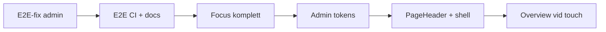

# Plan: CSS-uppföljning (C6+) och E2E-verifiering

**Status:** Pågående — E1–C9 implementerat 2026-06-13; E2E-verifiering klar (WP-suite + DoD 2026-06-13)  
**Relaterat:** [CSS_REFACTOR_PLAN.md](CSS_REFACTOR_PLAN.md), [TEST_IMPLEMENTATION_PLAN.md](TEST_IMPLEMENTATION_PLAN.md), [VUE_UI_COMPONENTS.md](VUE_UI_COMPONENTS.md), [STYLE_GUIDE.md](STYLE_GUIDE.md) §3

---

## Syfte

C1–C5 flyttade **ägande** till rätt komponenter (panel, focus, admin mobil, kalender, docs). Kvarvarande arbete är **komplettering, tokens, dokumentation av kontrakt** och **verifiering** — inte ny encapsulation.

**Ledprincip (oförändrad):** *Komponenten som äger DOM ska äga CSS.* Layout sätter context via tokens — inte barnens padding, färger eller focus.

---

## Baseline efter C1–C5 (2026-06-13)

| Signal | Status |
|--------|--------|
| `:deep(.mrt-step-panel*)` i layout | ✅ 0 |
| Blanket focus `:deep` i `MrtWizardShellSurfaces` | ✅ 0 |
| `AdminApp` mobil `:deep` | ✅ 1 kvar (`widefat` vertical-align) |
| `MonthCalendarApp` `:deep` | ✅ 2 (day-panel overview — dokumenterat undantag) |
| `mrtFocusRing.css` | ✅ Kärn-`Mrt*` |
| PHP/Vue alert dual track | ✅ Dokumenterat i STYLE_GUIDE |
| E2E WP-suite (`ci-e2e-wp.sh`) | ✅ Admin-specs gröna (2026-06-13) |

### Största scoped CSS (över ~100 rader)

| Rader | Fil | Åtgärd |
|------:|-----|--------|
| ~90 | `WizardSummaryStep.vue` | ✅ Print i `wizardSummaryPrint.css` |
| 152 | `MrtOverviewRailGroupGridRow.vue` | C9 vid overview-touch |
| ~140 | `MrtMonthDayCell.vue` | ✅ C6 focus i `mrtFocusRing.css` |
| 145 | `WizardFeedbackWidget.vue` | Vid widget-touch |
| 123 | `MrtCalendarGridTable.vue` | Tabell-DOM — OK att behålla `:deep` |
| 106 | `AdminMobilePageShell.vue` | ✅ C8 — CSS i `admin/styles/mobile/` |

### `:deep(` — inventering (2026-06-13, uppdaterad efter flytta/optimera)

**Totalt:** ~115 anrop i **~32 filer** (minskat från ~138 / 36).

| Klass | Status efter refaktor |
|-------|----------------------|
| ✅ **Acceptabel** | Oförändrat — WP, tabell-DOM, admin mobil |
| ⚠️ **Optimera** | ✅ **Klart** — DetailPanel, Timeline, Index, ShellSurfaces, RouteStep, StepPanel |
| 🔄 **Flytta** | ✅ **Klart** — SummaryStep, SelectedTrip, MainCard, TripCard |

#### Genomfört (2026-06-13)

| Område | Åtgärd |
|--------|--------|
| `WizardSummaryStep` | Prislayout → `MrtPriceTable context="summary"` + `MrtPriceTableList variant` |
| `MrtSelectedTrip` | `returnSummary` äger grön-kort-styling (bort från `WizardTripStep`) |
| `MrtWizardMainCard` | Bara CSS-tokens (`--mrt-heading-surface-color`, `--mrt-step-nav-margin-bottom`, …) |
| `MrtTripCard` | Slots `vehicles` / `duration` / `action`; `MrtVehicleRow layout="trip-card"` |
| `MrtDetailPanel` | Segment-tokens → `MrtDetailSegment` + `MrtVehicleRow` justify-variabler |
| `MrtTimeline` | `MrtExpandTrigger align/fullWidth` — inga `:deep` kvar |
| `MrtTimetableIndexCard` | `tone` prop för swatch-färg |
| `MrtStepPanel` | Panel-tokens + oscoped barnregler (ägare, ej layout `:deep`) |
| `JourneyWizardApp` | Äger errors/panels + `wizardStepSurfaces.css` |

#### ✅ Acceptabel — behåll

| Fil | Antal | Varför |
|-----|------:|--------|
| `MrtCalendarGridTable.vue` | 17 | Tabell/cell-DOM; kalender äger tabellstruktur |
| `MrtPriceTableMatrix.vue` | 16 | Tabell-DOM + responsiv kort-layout |
| `admin/styles/mobile/responsive-forms.css` | 9 | WP `.form-table`, `.widefat` i mobil-shell |
| `admin/styles/mobile/responsive-tables.css` | 8 | Responsiv tabell → kort (WP-mönster) |
| `admin/styles/mobile/responsive-cards.css` | 4 | Mobil card-list + row actions |
| `AdminRowActions.vue` | 3 | WP `.button` / delete-link |
| `AdminDateList.vue` | 3 | WP list + `.button-link` |
| `AdminInlineForm.vue` | 4 | WP `.regular-text` / `.button` |
| `TimetableTripFieldsBlock.vue` | 4 | WP `.widefat` / `.description` |
| `TimetableEditorDeviationDraftForm.vue` | 4 | WP fältklasser |
| `AdminFlashRow.vue` | 4 | `td`/`th` highlight i tabell |
| `MrtWizardShell.vue` | 5 | Box-sizing-reset på wizard-träd; shell-innehållsbredd |
| `RouteEditorFields.vue` | 3 | WP `select` / `.button` |
| `AdminActionBar.vue` | 2 | WP `.button` |
| `MonthCalendarApp.vue` | 2 | Dagpanel → overview (dokumenterat undantag) |
| `MrtCalendarGrid.vue` | 2 | Wizard-variant av kalendertabell |
| `RouteStationOrderEditor.vue` | 2 | WP `select` / `.button` |
| `AdminApp.vue` | 1 | `widefat td` vertical-align (enda kvarvarande app-root) |
| `AdminFormActions.vue` | 1 | WP `.button` |
| `AdminToolList.vue` | 1 | WP `.button` |
| `StationsPanel.vue` | 1 | WP `input.small-text` |
| `MobileTimetablePanel.vue` | 1 | WP `.widefat` |
| `StopTimesEditor.vue` | 1 | `input[type='time']` |
| `AdminFieldStack.vue` | 1 | WP `.description` |
| `TimetableEditorMetaPanel.vue` | 1 | WP `label` |
| `AdminTrainTypeSelect.vue` | 1 | WP `select` |
| `PricesPage.vue` | 1 | Sid-specifik priszon-modifier |

**Tumregel:** se [Regler för ny kod](#regler-för-ny-kod-checklista) nedan.

#### Tidigare flytta/optimera (referens — klart)

| Fil | Var |
|-----|-----|
| `WizardSummaryStep.vue` | → `MrtPriceTable` / `MrtSummaryCard` |
| `WizardTripStep.vue` | → `MrtSelectedTrip` |
| `MrtWizardMainCard.vue` | → tokens + stegkomponenter |
| `MrtTripCard.vue` | → strukturerade slots + `MrtVehicleRow` |
| `MrtDetailPanel.vue` | → segment-tokens |
| `MrtTimeline.vue` | → `MrtExpandTrigger` props |
| `MrtTimetableIndexView.vue` | → `MrtTimetableIndexCard tone` |
| `MrtWizardShellSurfaces.vue` | → tokens på shell |
| `WizardRouteStep.vue` | → `MrtAccentButton size="search"` |
| `MrtStepPanel.vue` | → panel-tokens (ej layout `:deep`) |

---

## Prioriterad ordning

1. **E1** — Fixa föråldrade WP-admin E2E (blockerar CSS DoD)  
2. **E0** — E2E grön i CI + dokumenterad Windows/Docker-körning  
3. **C6** — Focus ring komplett  
4. **C7** — Admin design tokens  
5. **C8** — `AdminPageHeader` + mobil-shell-split  
6. **C9** — Overview / stora SFC (vid nästa feature-touch)  

---

## Fas E1 — E2E-fix (admin + verifiering)

**Källa:** Lokalkörning 2026-06-13 — `scripts/ci-e2e-wp.sh` (12 passed, 4 failed, 4 skipped serial).

| PR | Test | Rotorsak | Fix |
|----|------|----------|-----|
| **E1.1** | `admin-dashboard` — stations routes route preview | Line registry visar **Linjer**-flik, inte **Rutter** | Klicka `stationsTabLines` eller gå till routes via lines-UI; uppdatera förväntan mot [LINES_ADMIN_PLAN.md](LINES_ADMIN_PLAN.md) |
| **E1.2** | `admin-import-export` — merge import | Hash-route / sidladdning — rubrik syns inte i tid | `gotoAdminRoute` + vänta på `h1` eller `networkidle`; ev. `waitForURL` på `#/import-export` |
| **E1.3** | `admin-timetable-flow` — lägg till tur | `getByLabel(/^rutt$/)` matchar inte fält efter lines-refaktor | Uppdatera selector mot faktisk label/ARIA i `TimetableTripFieldsBlock` |
| **E1.4** | `admin-traffic-notices` — reorder | Lennakatten-fixture (`Selkné`) ligger kvar överst | Isolera testdata (skapa två notices, sortera bara dessa) eller rensa/listfiltrera i `beforeEach` |

**DoD:** `bash scripts/ci-e2e-wp.sh` grön på Linux/CI; publik + admin smoke enligt [TEST_IMPLEMENTATION_PLAN.md](TEST_IMPLEMENTATION_PLAN.md).

---

## Fas E0 — E2E ergonomi (dokumentation)

| PR | Innehåll |
|----|----------|
| **E0.1** | [DEVELOPER.md](DEVELOPER.md) / [SMOKE_CHECKLIST.md](SMOKE_CHECKLIST.md): Windows utan host-`npm` — Playwright Docker (`mcr.microsoft.com/playwright:v1.60.0-jammy`) + `host.docker.internal:8080` |
| **E0.2** | Notera Playwright-version ↔ Docker image (package-lock kan ge nyare `@playwright/test` än CI-image) |

---

## Fas C6 — Focus ring komplett

**Symptom:** Lokala `:focus-visible` utanför `mrtFocusRing.css`.

| PR | Innehåll | Filer |
|----|----------|-------|
| **C6.1** | Utöka `mrtFocusRing.css` med kardinal-/cell-selectors | `mrtFocusRing.css` |
| **C6.2** | Importera delad focus; ta bort lokala regler | `MrtMonthDayCell.vue`, `MrtTimetableIndexCard.vue` |
| **C6.3** | Samma för wizard/admin-pickers | `WizardBetaBanner.vue`, `TrainTypeIconPicker.vue`, `OverviewGridCellEditor.vue` |
| **C6.4** | Dokumentera undantag (om något måste vara lokalt) | `VUE_UI_COMPONENTS.md` |

**DoD:** Inga duplicerade focus-block utanför `mrtFocusRing.css` + dokumenterade undantag.

---

## Fas C7 — Admin design tokens

**Symptom:** `AdminPanel` har `--mrt-admin-panel-*`; många `Admin*` har fortfarande `#c3c4c7`, `#fff`, `border-radius: 3px`.

| PR | Innehåll |
|----|----------|
| **C7.1** | Utöka `admin-shell.css`: `--mrt-admin-border`, `--mrt-admin-radius`, `--mrt-admin-surface-bg`, `--mrt-admin-text-muted`, … |
| **C7.2** | Migrera `AdminEmptyState`, `AdminRowActions`, `AdminFlashRow` |
| **C7.3** | Migrera feature-komponenter med hårdkodad WP-palett (`RoutePreview`, `TrainTypeIconPicker`, dashboard mobil-stat cards) |
| **C7.4** | STYLE_GUIDE: admin tokens vs publika `--mrt-wizard-*` / `--mrt-color-*` |

**DoD:** Nya admin-komponenter använder tokens; inga nya magic hex i `admin/components/`.

---

## Fas C8 — Admin-sidmönster och mobil-shell

| PR | Innehåll |
|----|----------|
| **C8.1** | Skapa `AdminPageHeader.vue` (h1 + valfri lead) — ersätt upprepat mönster på sidor |
| **C8.2** | Dela `AdminMobilePageShell`-CSS: `admin/mobile/responsive-tables.css`, `responsive-forms.css` (importerade i shell) |
| **C8.3** | Dokumentera i [vue-admin-folders.mdc](../.cursor/rules/vue-admin-folders.mdc) / VUE_UI_COMPONENTS |

**DoD:** `AdminMobilePageShell.vue` <60 rader scoped CSS; sidor använder `AdminPageHeader` där mönstret matchar.

---

## Fas C9 — Overview och stora SFC (vid touch)

**Inte egen sprint** — gör när overview/wizard-feedback/month-cell ändras.

| Område | Mål |
|--------|-----|
| `MrtOverviewRailGroupGridRow.vue` | CSS ner i cell-komponenter; shell tokens only |
| `MrtTimetableOverviewShell.vue` | <80 rader CSS (R4-mål från refaktor-plan) |
| `WizardSummaryStep.vue` | Print-CSS i `wizardSummaryPrint.css` (importerad) |
| `MrtSurfaceCard` + `AdminPanel` | Delade semantiska `--mrt-surface-*` tokens (inte sammanslagen komponent) |

---

## Dokumentation — wizard panel-tokenkontrakt

| PR | Innehåll |
|----|----------|
| **C6.5** / doc | `VUE_UI_COMPONENTS.md`: tabell över `--mrt-step-panel-*` — vem sätter (Hero, MainCard, ShellSurfaces), standardvärden i `MrtStepPanel` |

---

## Låg prioritet (backlog)

| ID | Punkt | Not |
|----|-------|-----|
| L1 | Global utilities i PHP | ~58 klasser; Vue → `MrtStack` |
| L2 | `MrtInlineSpinner` | Dela pseudo-element utan full `MrtAsyncState` |
| L3 | Admin/publik `border-radius` | 3px vs 0 — produkt/varumärke |
| L4 | PHP/Vue alert tokens | Dela fler semantiska tokens i `components-base.css` |

---

## Regler för ny kod (checklista)

1. **Ny interaktiv `Mrt*`** → `@import './mrtFocusRing.css'` eller utöka den filen.  
2. **Ny admin-yta** → `--mrt-admin-*` tokens, inte nya hex.  
3. **Layout → barn** → CSS-variabler på förälder, inte `:deep()` på barnklasser.  
4. **Tabell-DOM** → `:deep` på cellinnehåll är OK om cell-komponenten äger sin CSS.  
5. **Ny admin-sida** → `AdminMobilePageShell` + `AdminPageHeader`; mobil-CSS i shell/feature, inte `AdminApp`.  
6. **Dokumentation** → uppdatera `VUE_UI_COMPONENTS.md` vid ny export eller delad mekanism-CSS.

---

## Definition of done (hela uppföljningen)

- [x] E1: WP E2E-suite grön (`ci-e2e-wp.sh`) — admin-specs verifierade 2026-06-13
- [x] E0: Windows/Docker E2E dokumenterat
- [x] C6: Focus ring utan duplicering (+ dokumenterade undantag)
- [x] C7: Admin tokens utbredda
- [x] C8: `AdminPageHeader` + slimmad mobil-shell
- [x] Panel-tokenkontrakt i VUE_UI_COMPONENTS
- [x] C9: `wizardSummaryPrint.css` + `--mrt-surface-*` tokens

---

## Referens — planserie

| Plan | Status |
|------|--------|
| [CSS_ENCAPSULATION_PLAN.md](CSS_ENCAPSULATION_PLAN.md) | Klar |
| [CSS_REFACTOR_PLAN.md](CSS_REFACTOR_PLAN.md) R0–R5 | Klar (2026-06-12) |
| [CSS_RESPONSIBILITY_PLAN.md](CSS_RESPONSIBILITY_PLAN.md) C1–C5 | Klar (2026-06-13) |
| **CSS_FOLLOWUP_PLAN.md** C6+, E0–E1 | Denna plan |
