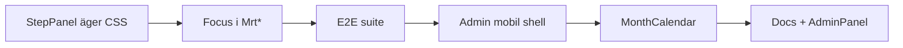

# Plan: CSS-ansvar och minskad duplicering

**Status:** Klar (2026-06-13) — efter [CSS_REFACTOR_PLAN.md](CSS_REFACTOR_PLAN.md) (klar 2026-06-12)  
**Uppföljning:** [CSS_FOLLOWUP_PLAN.md](CSS_FOLLOWUP_PLAN.md) (C6+, E0–E1)  
**Relaterat:** [VUE_UI_COMPONENTS.md](VUE_UI_COMPONENTS.md), [STYLE_GUIDE.md](STYLE_GUIDE.md) §3, [CSS_ENCAPSULATION_PLAN.md](CSS_ENCAPSULATION_PLAN.md)

---

## Syfte

Refaktor R0–R5 löste **inkapsling och filstorlek**. Kvarvarande skuld är **fel ägande**: layout-föräldrar stylar barn via `:deep()`, samma semantik (focus, panel, alert) underhålls på flera ställen, och app-roots agerar theme-motor.

**Ledprincip:** *Komponenten som äger DOM ska äga CSS.* Layout sätter context (tokens, max-width, embedded) — inte barnens padding, färger eller focus.

**Mått på framsteg (viktigare än radantal):**

| Signal | Nu (ungefär) | Mål |
|--------|--------------|-----|
| `:deep(.mrt-step-panel*)` i layout | 3 filer | 0 — styling i `MrtStepPanel` |
| Blanket `:focus-visible` i shell | `MrtWizardShellSurfaces` | 0 — focus i interaktiva `Mrt*` |
| `:deep(` i `AdminApp` (mobil) | ~22 | <5 — shell only |
| `:deep(` i `MonthCalendarApp` | ~12 | <4 — app tokens only |
| PHP `.mrt-alert` vs Vue `.mrt-ui-alert` | Dubbel regeluppsättning | Dokumenterat dual track **eller** gemensamma tokens |

---

## Nuläge — vad som redan fungerar

| Mönster | Exempel | Behåll |
|---------|---------|--------|
| Delad domän-CSS | `overviewStatus.css` (7 overview-SFC) | ✅ Förebild för status/avvikelse |
| Delad mekanism-CSS | `mrtSpinnerStyles.css` i `MrtAsyncState` | ✅ Pseudo-element / animation |
| Context i logik | `uiContext.ts`, `MrtButton` / `MrtAlert` `context="admin"` | ✅ Utöka, duplicera inte komponenter |
| WP vs Vue layout | `public-layout.css` + `MrtPublicAppShell` | ✅ Tydlig gräns |
| Feature-split | `MrtPriceTableList` / `MrtPriceTableMatrix` | ✅ Olika layout-ansvar |

---

## Problemområden (prioriterade)

### P1 — `MrtStepPanel` utan CSS (split ownership)

**Symptom:** `MrtStepPanel.vue` har markup men ingen `<style>`. Visuella regler spridda i:

- `MrtWizardShellSurfaces.vue` — padding, grön yta, focus, typografi
- `MrtWizardMainCard.vue` — reset (transparent panel i kort)
- `MrtWizardHero.vue` — embedded search-steg

**Risk:** Nytt steg eller layout-gren bryts utan att alla tre filer uppdateras.

**Mål:** Panel-CSS i `MrtStepPanel` med props t.ex. `surface: 'green' | 'transparent'`, `embedded`, `variant: 'default' | 'search' | 'wide'`.

---

### P2 — Focus ring (centraliserad + duplicerad)

**Symptom:**

- Blanket `:deep(button:focus-visible)` m.m. i `MrtWizardShellSurfaces`
- Samma `outline: 3px solid var(--mrt-wizard-focus)` i `MrtStepHeader`, `MrtStepProgress`, `MrtCalendarNav`, `WizardTripStep`
- `MrtButton` saknar `:focus-visible` — fungerar bara där shell når den

**Mål:** Varje interaktiv `Mrt*` äger focus; delad `mrtFocusRing.css` (samma modell som `mrtSpinnerStyles.css`).

---

### P3 — `AdminApp` som mobil layout-godfil

**Symptom:** ~22 `:deep`-regler för `.mrt-admin-page--mobile`, sid-specifika klasser (`mrt-price-matrix-table`, import/export, form-table).

**Mål:** `AdminMobilePageShell.vue` (eller per-page scoped) — sidor optar in; `AdminApp` behåller endast flex-nav + h1-margin.

---

### P4 — `MonthCalendarApp` theme overrides

**Symptom:** App-root tvingar `border-radius: 0`, duplicerar `.mrt-empty`, responsiv nav via `:deep` på `MrtCalendarNav`.

**Mål:** `--mrt-radius: 0` på `.mrt-month` root; radius/responsive i `MrtCalendarNav` / `MrtMonthDayCell`; använd `MrtAsyncState` konsekvent.

---

### P5 — Alert/box dual track (PHP vs Vue)

**Symptom:** `.mrt-alert` i `components-base.css` (PHP) speglar `.mrt-ui-alert` i `MrtAlert.vue`.

**Mål (välj en):**

- **A)** Dokumentera permanent dual track i STYLE_GUIDE + BRAND_UI  
- **B)** Gemensamma semantiska tokens; minimera duplicerade regelblock

---

### P6 — Panel-primitiver (admin)

**Symptom:** `AdminPanel` hårdkodade hex/skugga parallellt med `MrtSurfaceCard` och global `.mrt-box`.

**Mål:** Admin tokens (`--mrt-admin-panel-*`) eller tydlig WP-postbox-wrapper — inga nya magic numbers.

---

## Faser och PR-backlog

Varje rad = **en reviewbar PR**. Kör `.\scripts\vue-check.ps1`, relevant E2E, uppdatera docs.

### Fas C1 — Wizard panel-ansvar (högsta impact)

| PR | Innehåll | Filer |
|----|----------|-------|
| **C1.1** | Flytta panel-base + variant-CSS till `MrtStepPanel` | `MrtStepPanel.vue` |
| **C1.2** | Props `surface` / `embedded`; ta bort `:deep(.mrt-step-panel*)` från `MrtWizardMainCard` | layout/* |
| **C1.3** | Flytta resterande panel + search/date-regler från `MrtWizardShellSurfaces` | `MrtStepPanel`, `MrtWizardShellSurfaces` |
| **C1.4** | Embedded search-justering från `MrtWizardHero` → panel prop eller hero slot-context | `MrtWizardHero`, wizard steps |

**DoD:** Inga `:deep(.mrt-step-panel*)` i layout; wizard layout-E2E gröna.

---

### Fas C2 — Focus ring i primitiver

| PR | Innehåll |
|----|----------|
| **C2.1** | Skapa `mrtFocusRing.css`; `:focus-visible` i `MrtButton` |
| **C2.2** | Focus i `MrtCombobox`, `MrtSegmentedControl`, `MrtExpandTrigger` |
| **C2.3** | Ersätt lokala focus-regler i `MrtStepHeader`, `MrtStepProgress`, `MrtCalendarNav`, `WizardTripStep` |
| **C2.4** | Ta bort blanket focus `:deep` från `MrtWizardShellSurfaces` |

**DoD:** `MrtButton` har focus utan wizard-shell; inga duplicerade focus-block utanför `mrtFocusRing.css` + komponent-specifika undantag (dokumenterade).

---

### Fas C3 — Admin mobil-layout

| PR | Innehåll |
|----|----------|
| **C3.1** | Skapa `AdminMobilePageShell.vue` med nuvarande `AdminApp` mobil `:deep` |
| **C3.2** | Wrappa mobil-sidor (Prices, ImportExport, TrainTypes, …) |
| **C3.3** | Slimma `AdminApp` till nav + main shell |

**DoD:** `AdminApp.vue` <80 rader CSS; mobil-regler i shell eller page, inte app-root.

---

### Fas C4 — Månadskalender app-ansvar

| PR | Innehåll |
|----|----------|
| **C4.1** | Flytta nav responsive från `MonthCalendarApp` → `MrtCalendarNav` |
| **C4.2** | Ta bort `:deep(.mrt-empty)`; använd `MrtAsyncState` |
| **C4.3** | Ersätt `:deep(border-radius: 0)` med root token eller komponent-props |

**DoD:** `MonthCalendarApp` stylar bara `.mrt-month` grid-wrap/tokens; month E2E grön.

---

### Fas C5 — Dokumentation och admin panel (lägre prioritet)

| PR | Innehåll |
|----|----------|
| **C5.1** | STYLE_GUIDE: PHP `.mrt-alert` vs Vue `.mrt-ui-alert` (dual track eller tokens) |
| **C5.2** | `AdminPanel` → admin design tokens |
| **C5.3** | Uppdatera VUE_UI_COMPONENTS med `mrtFocusRing.css`-mönster |

---

## Prioriterad ordning

1. **C1** — `MrtStepPanel` (störst minskning av `:deep` och split ownership)  
2. **C2** — focus i primitiver  
3. **E2E** — full publik suite + admin smoke (DoD från refaktor-plan)  
4. **C3** — admin mobil  
5. **C4** — månadskalender  
6. **C5** — docs + AdminPanel  

---

## Definition of done (hela initiativet)

- [x] `MrtStepPanel` har scoped CSS; layout utan `:deep(.mrt-step-panel*)`
- [x] Interaktiva `Mrt*` äger `:focus-visible`; `mrtFocusRing.css` delad
- [x] `MrtWizardShellSurfaces` utan blanket focus `:deep`
- [x] `AdminApp` utan sid-specifik mobil `:deep` (flyttat till shell/page)
- [x] `MonthCalendarApp` utan `:deep` på alerts/nav/empty (utom dokumenterade undantag)
- [x] PHP/Vue alert-spår dokumenterat i STYLE_GUIDE
- [ ] E2E: publik suite + admin smoke grön — se [CSS_FOLLOWUP_PLAN.md](CSS_FOLLOWUP_PLAN.md) E0–E1

---

## Risker

| Risk | Mitigering |
|------|------------|
| Panel-props blir för många | Börja med `surface` + `variant`; hero/card skickar props explicit |
| Focus ser annorlunda ut per vy | En `--mrt-focus-ring-*` token; E2E a11y + manuell wizard smoke |
| Admin mobil split ökar wrapper-djup | En `AdminMobilePageShell`; sidor utan mobil behöver inte wrappa |
| PR kedja lång | C1.1–C1.4 kan mergas om reviewbar storlek tillåts |

---

## Referens — `:deep(` volym (baseline 2026-06-12)

| Fil | `:deep(` | Roll efter plan |
|-----|----------|-----------------|
| `MrtWizardShellSurfaces.vue` | ~25 | Shell tokens, errors max-width — inte panel/focus |
| `AdminApp.vue` | ~22 | Nav flex only |
| `MrtPriceTableMatrix.vue` | ~16 | OK (tabell-DOM) |
| `MonthCalendarApp.vue` | ~12 | `.mrt-month` tokens only |
| `MrtWizardMainCard.vue` | ~9 | Kort-yta, beta/nav spacing — inte panel reset |
