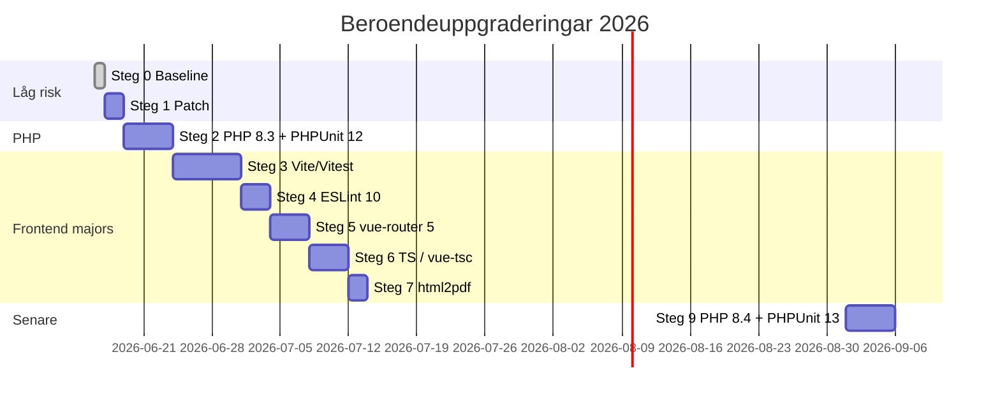

# Åtgärdsplan — beroendeuppgraderingar

**Datum:** 2026-06-17  
**Syfte:** Stegvis, granskningsvänlig uppgradering av Composer-, npm- och Docker-beroenden utan att störa CI eller produktionsflöden.

**Relaterat:** [DEVELOPER.md](DEVELOPER.md), [CI_AND_DEV_MODEL.md](CI_AND_DEV_MODEL.md), [SMOKE_CHECKLIST.md](SMOKE_CHECKLIST.md), [DOCKER_SCRIPTS_PLAN.md](DOCKER_SCRIPTS_PLAN.md), [frontend/vue/TESTING.md](../frontend/vue/TESTING.md).

---

## Statusöversikt

| Steg | Fokus | Risk | Status |
|------|-------|------|--------|
| **0** | Baseline (Actions, Playwright 1.61, PHPStan 2.2) | Låg | **Klar** — commit `0fd775a` |
| **1** | Patch under befintliga majors (npm + Composer) | Låg | Öppen |
| **2** | PHP 8.3 + PHPUnit 12 | Medel | Öppen |
| **3** | Vite 8 + Vitest 4 + happy-dom | Hög | Öppen |
| **4** | ESLint 10-stack | Medel | Öppen |
| **5** | vue-router 5 | Medel | Öppen |
| **6** | vue-tsc 3 + TypeScript 6 | Medel | Öppen |
| **7** | html2pdf.js 0.14 (PDF-export) | Medel | Öppen |
| **8** | Infrastruktur (MariaDB, Playwright-sync) | Låg | Löpande |
| **9** | PHP 8.4 + PHPUnit 13 *(valfritt)* | Hög | Parkerad |

**Rekommenderad ordning:** 1 → 2 → 3 → 4 → (5 och 6 parallellt om möjligt) → 7. Steg 9 först efter stabil PHP 8.3/12-miljö.

---

## Nuläge (efter steg 0)

| Lager | Nyckelversioner |
|-------|-----------------|
| PHP | 8.2 (CI, Docker, `composer.json`) |
| PHPUnit | 11.5.x *(EOL feb 2026 — bugfix-stöd ute)* |
| PHPStan | 2.2.2 |
| Vue | 3.5.x |
| Vite / Vitest | 6.4 / 3.2 |
| ESLint | 9.x (flat config) |
| Playwright | 1.61 (npm + `mcr.microsoft.com/playwright:v1.61.0-jammy`) |
| GitHub Actions | checkout/setup-node v5, upload-artifact v6 |

**Synkregel:** `@playwright/test` i `package-lock.json` ska alltid matcha Playwright-taggen i `docker-compose.yml`. E2E kör `docker compose run --rm` (inte `exec` i gammal container) — se `scripts/lib/mrt/tools.sh` och `scripts/lib/Mrt.ToolsShell.ps1`.

---

## Principer

1. **Ett steg = en PR** när möjligt — lättare review och enklare rollback.
2. **Kör alltid i Docker** — `.\scripts\mrt.ps1 check -Vue`, `mrt test`, `mrt e2e`, `mrt dev e2ewp` (Git Bash för WP-E2E).
3. **Major-bumps i batch** — Vite/Vitest och ESLint-plugin ska inte höjas isolerat.
4. **Committa ombyggda dist** — `assets/dist/vue/` efter `npm run build`.
5. **PHP före PHPUnit-major** — PHPUnit 12 kräver PHP ≥ 8.3; PHPUnit 13 kräver PHP ≥ 8.4.
6. **Dokumentera image-taggar** — uppdatera `DEVELOPER.md` / `SMOKE_CHECKLIST.md` vid Playwright-bump.

---

## Steg 0 — Baseline *(klar)*

**Levererat i `0fd775a`:**

- GitHub Actions v5/v6 (tar bort Node 20-deprecation-varningar)
- `@playwright/test` 1.61 + Docker `v1.61.0-jammy`
- PHPStan 2.2.2, PHPCS installer 1.2.1
- npm patch/minor inom befintliga majors + ombyggd dist
- `vue-e2e`: alltid `run --rm` (bash + PowerShell)

---

## Steg 1 — Patch under befintliga majors

**Mål:** Hålla låset fräscht utan breaking changes.  
**Beräknad insats:** ~30 min + CI.

| ID | Uppgift | Filer / kommandon |
|----|---------|-------------------|
| 1.1 | `npm update` inom `^`-ranges | `frontend/vue/package.json`, `package-lock.json` |
| 1.2 | `composer update` direkta dev-deps | `composer.json`, `composer.lock` |
| 1.3 | Verifiera gates | `mrt check -Vue`, `mrt e2e` |

**Typiska kandidater:** `typescript-eslint` patch, `@rollup/rollup-win32-x64-msvc`, `phpstan` 2.2.x, `phpunit` 11.5.x sista patch.

**Acceptanskriterium:** Grön CI (`validate` + `e2e-wp`), inga nya lint-/Stan-fel.

**PR-titel (förslag):** `Bump patch dependencies (npm + Composer).`

---

## Steg 2 — PHP 8.3 + PHPUnit 12

**Mål:** Lämna PHPUnit 11 (EOL) och få aktivt bugfix-stöd utan att hoppa till PHP 8.4 direkt.  
**Beräknad insats:** 0,5–1 dag + CI.

### Beslut (före kod)

| Alternativ | PHPUnit | Kommentar |
|------------|---------|-----------|
| **A (rekommenderat)** | 12.x | PHP 8.3 — minsta hopp från 8.2 |
| B | 13.x | Kräver PHP 8.4 — se steg 9 |

### Uppgifter

| ID | Uppgift | Filer |
|----|---------|-------|
| 2.1 | Höj PHP-krav | `composer.json` (`"php": ">=8.3"`) |
| 2.2 | WordPress Docker | `Dockerfile` → `wordpress:php8.3-apache` |
| 2.3 | WP-CLI | `docker-compose.yml` → `wordpress:cli-php8.3` |
| 2.4 | PHP-test image | `docker/Dockerfile.tools` → `php:8.3-cli-bookworm` |
| 2.5 | CI | `.github/workflows/ci.yml` → `php-version: '8.3'` |
| 2.6 | PHPUnit 12 | `composer.json` → `"phpunit/phpunit": "^12.0"`, `composer update` |
| 2.7 | Fixa eventuella test-API-ändringar | `tests/` |
| 2.8 | Dokumentation | `DEVELOPER.md`, `.devcontainer/README.md`, ev. `PHP_INSTALL_WINDOWS.md` |

**Verifiering:**

```powershell
.\scripts\mrt.ps1 check
.\scripts\mrt.ps1 test
.\scripts\mrt.ps1 dev reset    # vid behov — ny PHP-image
bash scripts/mrt.sh dev e2ewp  # WP E2E
```

**Acceptanskriterium:** Alla PHPUnit-tester gröna; WP E2E grön; ingen regression i `composer check`.

**PR-titel (förslag):** `Upgrade to PHP 8.3 and PHPUnit 12.`

---

## Steg 3 — Vite 8 + Vitest 4 + happy-dom

**Mål:** Modern frontend-toolchain; höj **tillsammans** (inte vite ensam).  
**Beräknad insats:** 1–2 dagar.

| ID | Uppgift | Paket |
|----|---------|-------|
| 3.1 | Läs migreringsguider | [Vite](https://vite.dev/guide/migration), [Vitest](https://vitest.dev/guide/migration) |
| 3.2 | Bump toolchain | `vite` ^8, `@vitejs/plugin-vue` ^6, `vitest` ^4, `happy-dom` ^20 |
| 3.3 | Justera config vid behov | `vite.config.ts`, `vite.admin.config.ts`, `vite.pdf.config.ts`, ev. `vitest` config |
| 3.4 | Bygg om dist | `npm run build` → `assets/dist/vue/` |
| 3.5 | E2E-snapshots | Granska Playwright-snapshots om layout skiftar |

**Filer:** `frontend/vue/package.json`, `package-lock.json`, vite-configs, dist-assets.

**Acceptanskriterium:** `mrt vue-check` grön; `mrt e2e` grön; `npm run verify` grön.

**PR-titel (förslag):** `Upgrade Vite 8 and Vitest 4.`

---

## Steg 4 — ESLint 10-stack

**Mål:** Aktuell lint utan att blanda med Vite-bump (kan köras efter steg 3 eller i samma PR om liten diff).  
**Beräknad insats:** 2–4 h.

| ID | Uppgift | Paket |
|----|---------|-------|
| 4.1 | Bump tillsammans | `eslint` ^10, `eslint-plugin-vue` ^10, `vue-eslint-parser` ^10 |
| 4.2 | Verifiera flat config | `frontend/vue/eslint.config.js` |
| 4.3 | Fixa nya regelbrott | `frontend/vue/src/`, `e2e/` |

**Acceptanskriterium:** `npm run lint` grön som del av `mrt vue-check`.

**PR-titel (förslag):** `Upgrade ESLint 10 and vue plugin stack.`

---

## Steg 5 — vue-router 5

**Mål:** Hålla routing-biblioteket under aktivt underhåll.  
**Beräknad insats:** 0,5–1 dag.

| ID | Uppgift | Notering |
|----|---------|----------|
| 5.1 | Läs [vue-router v5 migration](https://router.vuejs.org/guide/migration/) | Breaking API |
| 5.2 | Uppdatera routes/guards | `frontend/vue/src/` (wizard, admin) |
| 5.3 | E2E för navigation | `e2e/admin-nav.spec.ts`, `e2e/wizard-steps.spec.ts`, `e2e/month-nav.spec.ts` |

**Acceptanskriterium:** Alla router-relaterade E2E gröna; manuell smoke wizard + admin-flikar.

**PR-titel (förslag):** `Upgrade vue-router to v5.`

---

## Steg 6 — vue-tsc 3 + TypeScript 6

**Mål:** Striktare och aktuell typkontroll.  
**Beräknad insats:** 0,5–1 dag (beroende på nya typfel).

| ID | Uppgift | Ordning |
|----|---------|---------|
| 6.1 | `vue-tsc` ^3 | Först — identifiera nya fel |
| 6.2 | `typescript` ^6 | Efter vue-tsc är grön |
| 6.3 | Rätta typfel | Komponenter, composables, `e2e/` |

**Acceptanskriterium:** `npm run typecheck` grön; `mrt vue-check` grön.

**PR-titel (förslag):** `Upgrade vue-tsc 3 and TypeScript 6.`

---

## Steg 7 — html2pdf.js 0.14

**Mål:** Säkerhets- och underhållsuppdatering för PDF-export.  
**Beräknad insats:** 2–4 h + manuell PDF-smoke.

| ID | Uppgift | Filer |
|----|---------|-------|
| 7.1 | Bump `html2pdf.js` | `package.json`, `package-lock.json` |
| 7.2 | Bygg om PDF-bundle | `vite.pdf.config.ts` → `assets/dist/vue/assets/trip-pdf.js` |
| 7.3 | Verifiera API | `src/wizard/utils/downloadTripSummaryPdf.ts`, `pdf-vendor-entry.ts` |
| 7.4 | Test | E2E `wizard-steps` (PDF-knapp); manuell nedladdning i wizard |

**Risk:** 0.10 → 0.14 är stor hopp inom 0.x — bundle-storlek och runtime-beteende kan skifta.

**Acceptanskriterium:** PDF genereras korrekt i wizard (utskrift + nedladdning); `mrt e2e` grön.

**PR-titel (förslag):** `Upgrade html2pdf.js and rebuild trip-pdf bundle.`

---

## Steg 8 — Infrastruktur *(löpande)*

| ID | Uppgift | När |
|----|---------|-----|
| 8.1 | `mariadb:11.4` → senaste `11.x` | Vid Docker-underhåll; kör `dev reset` + smoke |
| 8.2 | Playwright npm ↔ Docker-image | Varje `@playwright/test`-bump |
| 8.3 | Node 22 → 24 | Parkerad tills Node 24 LTS är etablerad i CI |
| 8.4 | Host Composer 1.x | Använd alltid `mrt`/Docker — uppgradera inte host Composer om osäkert |

---

## Steg 9 — PHP 8.4 + PHPUnit 13 *(valfritt, senare)*

**Förutsättning:** Steg 2 genomfört och stabil i minst en sprint.

| ID | Uppgift |
|----|---------|
| 9.1 | PHP 8.4 i Docker, CI, `composer.json` |
| 9.2 | `phpunit/phpunit` ^13 |
| 9.3 | Migrera bort deprecated PHPUnit-API enligt [PHPUnit 13 announcement](https://phpunit.de/announcements/phpunit-13.html) |

**Skjut upp om:** Ingen host/CI med PHP 8.4 ännu, eller om PHPUnit 12 räcker för projektets behov.

---

## Verifieringsmatris (per PR)

| Gate | Kommando | Steg |
|------|----------|------|
| PHP snabb | `.\scripts\mrt.ps1 check` | 1–2, 9 |
| PHP lint | `.\scripts\mrt.ps1 lint` | 1–2 |
| PHPUnit | `.\scripts\mrt.ps1 test` | 2, 9 |
| Vue full | `.\scripts\mrt.ps1 vue-check` | 1, 3–7 |
| Statisk E2E | `.\scripts\mrt.ps1 e2e` | 1, 3–7 |
| WP E2E | `.\scripts\mrt.ps1 dev e2ewp` | 2–7 |
| Full gate | `.\scripts\mrt.ps1 check -Vue` | Alla |

---

## Medvetet utanför scope (just nu)

| Paket / område | Varför vänta |
|----------------|--------------|
| PHPUnit 13 utan PHP 8.4 | Hårt versionskrav |
| Vite 8 utan Vitest 4 | Peer/incompat risk |
| ESLint 10 utan eslint-plugin-vue 10 | Konfiguration bryts |
| `vue-router` 5 i samma PR som Vite 8 | För stor review-yta |
| Node 24 | Node 22 LTS räcker till 2027 |

---

## Tidslinje (förslag)



*Tidslinjen är vägledande — justera efter teamkapacitet och CI-resultat.*

---

## Checklista före merge (varje steg)

- [ ] `package-lock.json` / `composer.lock` committade
- [ ] Dist ombyggd om frontend ändrats
- [ ] Playwright Docker-tag uppdaterad om `@playwright/test` ändrats
- [ ] Relevant doc (`DEVELOPER.md`, denna plan) uppdaterad
- [ ] CI grön på PR
- [ ] Statusrad i tabellen **Statusöversikt** ovan uppdaterad
