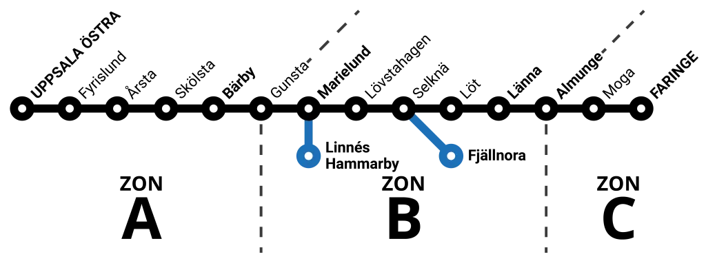

# Priszoner (Lennakatten taxa 2026)

Stationer tilldelas priszoner **1–3** enligt Lennakatten. Prismatrisen och prislookup använder **tre zoner** (`zone_cap` = 3).

**Källa:** [lennakatten.se/biljetter](https://www.lennakatten.se/biljetter/) och zonöversikten nedan (Lennakatten grafisk taxa 2026).



## Stationer per zon

| Zon | Stationer |
|-----|-----------|
| **1** | Uppsala Östra, Fyrislund, Årsta, Skölsta, Bärby |
| **1 och 2** (gräns) | **Gunsta** |
| **2** | Marielund, Lövstahagen, Selknä, Löt, Länna, Fjällnora |
| **2 och 3** (gräns) | **Almunge** |
| **3** | Moga, Faringe, Linnés Hammarby |

Endast **Gunsta** och **Almunge** har två zoner (gränsstationer mellan prisband). Övriga stationer har exakt en zon.

## Implementation

- **Per station (meta/CSV):** `price_zones` — se [CSV_FORMAT.md](CSV_FORMAT.md)
- **Referens (Lennakatten, dev/test):** `MRT_lennakatten_reference_station_price_zones_by_title()` i `inc/import/lennakatten/reference-data.php`
- **Zonberäkning för resa:** `inc/domain/pricing/price-rules.php` — lägsta giltiga zontal längs betjänade hållplatser på **utresan**. Tur och retur använder samma zonband som utresan (A→B); återresan höjer inte zontalet.

## CSV-exempel (`stations.csv`)

```csv
station_code,name,...,price_zones
uppsala-ostra,"Uppsala Östra",...,1
gunsta,Gunsta,...,"1,2"
almunge,Almunge,...,"2,3"
marielund,Marielund,...,2
```

Tom `price_zones` → inga zoner (konfigurera via CSV/admin). Gränsstationer: kommaseparerade, max två värden.

## Backlog / TODO

### Konfigurerbar prisstruktur (inte bara belopp)

**Status:** Implementerad (admin, REST, reseplanerare, CSV).

Administratören kan ändra **prisbelopp** och **strukturen** via admin → Priser:

| Dimension | Konfigurerbart via | Lagring |
|-----------|-------------------|---------|
| **Biljettyper** | Prisstruktur-panel | `mrt_price_schema` |
| **Kundkategorier** | Prisstruktur-panel | `mrt_price_schema` |
| **Priszoner (matriskolumner)** | Prisstruktur-panel | `mrt_price_schema` |
| **Max zoner vid lookup** | Prisstruktur-panel | `mrt_price_schema.zone_cap` |
| **Eftermiddags-retur** | Prisstruktur-panel | `mrt_price_schema.afternoon_return` |
| **Belopp** | Prismatris | `mrt_price_matrix` |

**CSV:** `price_schema.csv` (struktur) + `prices.csv` (belopp) exporteras/importeras tillsammans med priser.

**Kod:** `inc/domain/pricing/price-schema.php`, admin `PricesPage.vue`, `MrtPriceTable.vue` (dynamiska nycklar från server-etiketter).
