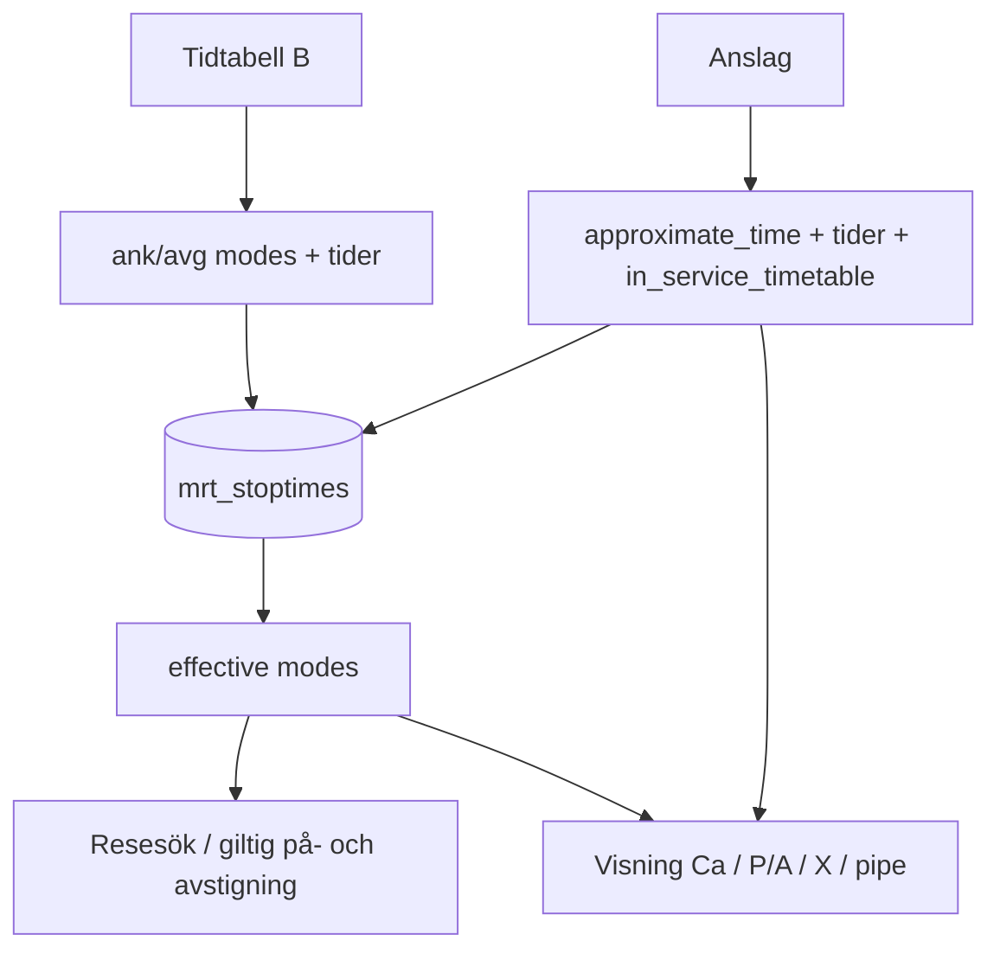

# Stopptider — källor och datamodell (skiss)

**Datum:** 2026-06-10 (uppdaterad 2026-06-10, fas 4-beslut)  
**Status:** Fas 3 klar — fas 4 planerad (Ca/visning) — se [STOP_TIME_V3_IMPLEMENTATION.md](STOP_TIME_V3_IMPLEMENTATION.md)  
**Relaterat:** [STOP_TIME_CA.md](STOP_TIME_CA.md), [DATA_MODEL.md](DATA_MODEL.md) §3.1, [CSV_FORMAT.md](CSV_FORMAT.md)

## Bakgrund

Idag importeras stopptider huvudsakligen från **anslagstidtabellen**. `pickup_allowed` / `dropoff_allowed` blandas med **P/A/X/behov** och kan inte skilja **fast** (⊗, ⓟ, ⓐ) från **behov** (x, p, a).

**Beslut:** två källor, tydligt ansvar. **Visning** som idag/anslagstavla; **datamodell** rikare för beräkning och korrekt fotnotlogik.

| Källa | Fil (referens) | Primär för |
|-------|----------------|------------|
| **Tidtabell B** | `testdata/reference-pdfs/Tidtabellsboken-del-B.pdf` | Tider, ordning, Ank/Avg, uppehållstecken (fast vs behov), ○ |
| **Anslagstidtabell** | `testdata/reference-pdfs/Anslagstidtabell-2026.pdf` | **Ca** (`approximate_time`), public tidsvalidering |

**Referenstur för verifiering (GRÖN):** tåg **71** (Uppsala Östra → Marielund m.fl.) — redan stickprov i `LennakattenJourneySearchTest` och [reference-pdfs/README.md](../testdata/reference-pdfs/README.md).

**Övergång:** tills B-import i skript finns fortsätter fixture från **anslag** + heuristik; ny CSV skrivs direkt i v3-format (modes), inte översatt från gamla booleans.

**Ej live:** rent schema-byte, reset + omimport — se [Schema v3](#schema-v3--rent-byte).

---

## Beslut (2026-06-10)

| # | Fråga | Beslut |
|---|--------|--------|
| 1 | Finns tidtabell B? | Ja — `testdata/reference-pdfs/Tidtabellsboken-del-B.pdf` |
| 2 | Referenstur | GRÖN tabell, t.ex. **tur 71** |
| 3 | **x** med tid i B | Ja — `on_request` för på **och** av även när Ank/Avg har klockslag |
| 4 | Olika tecken i Ank vs Avg | Ja — **fyra mode-fält** (se nedan) |
| 5 | `in_service_timetable = 0` ⇒ Ca? | **Ja** — saknas i B ⇒ `approximate_time = 1` automatiskt |
| 11 | Anslutningsbuss i B? | Klockslag **endast anslag**; B har anslutningsnotiser i tågkörplan — se [§ Buss vs rälsbuss](#buss-vs-rälsbuss) |
| 12 | `in_service_timetable` för anslutningsbuss | **Ja** — hela bussturen `0` ⇒ `approximate_time = 1` (Ca) |
| 6 | ○ (ingen trafikutbyte i B) | B: inga klockslag i tabell B; anslag fyller tid + Ca + symbol (t.ex. Skölsta **Ca 10.09 X**) — **inte** `\|` när anslag har **X** med tid |
| 13 | Fet vs normal typografi i anslag-PDF | **Ignoreras** — Ca styrs av regeln nedan, inte fetstil |
| 14 | När ska Ca gälla? | **Endast mellanstationer utan klockslag i tidtabell B** — start/slut med B-tid ⇒ `approximate_time = 0`; mellanstation **med** B-tid ⇒ `0` |
| 15 | Cellordning (Turvy/wizard) | **Ca före** klockslag; **P/A-fotnot efter** tiden (liten typografi) — se [STOP_TIME_CA.md](STOP_TIME_CA.md) |
| 16 | Stationskolumn i Turvy | Stationsnamn **normal** storlek; liten text endast för Ca + fotnotstecken — inte stationsetiketten |
| 7 | Admin | Ja — tre lägen per riktning **ersätter** P/A-kryss (se [Admin](#admin--tre-lägen-istället-för-kryss)) |
| 8 | Utseende vs data | **Samma utseende** som idag/anslag i wizard/översikt; **mer data** internt för beräkning/fotnoter |
| 9 | Fixture tills B-skript | Ja — fortsätt från anslag-PDF, skriv v3-CSV |
| 10 | ● obevakad station | **Ur scope** — irrelevant för oss |

---

## Officiella uppehållstecken (passagerare)

| Tecken | Passagerare | Läge |
|--------|-------------|------|
| **○** | Stopp utan trafikutbyte | — |
| **ⓟ** | Endast påstigning | Fast |
| **ⓐ** | Endast avstigning | Fast |
| **⊗** | På + av | Fast |
| **p** | Endast påstigning | Behov |
| **a** | Endast avstigning | Behov |
| **x** | På + av | Behov |

**Ca** = presentationskvalitet på tid (anslag), **inte** uppehållstecken — fält `approximate_time`.

Tecken mappas **per kolumn** i B (Ank respektive Avg). Ett tecken i en kolumn ger båda riktningarna enligt tabellen ovan (t.ex. **p** → pickup `on_request`, dropoff `none`).

---

## Målmodell — `mrt_stoptimes` (schema v3)

### Tider (från tidtabell B)

| Kolumn | Betydelse |
|--------|-----------|
| `arrival_time` | Ank `HH:MM` (NULL om ej i B) |
| `departure_time` | Avg `HH:MM` (NULL om ej i B) |

Endpoint-trimning oförändrad (första stopp utan ankomst, sista utan avgång).

### Lägen — får man stiga på/av? (ersätter `pickup_allowed` / `dropoff_allowed`)

Värden: `none` | `scheduled` | `on_request`

| Kolumn | Källa | Tolkning |
|--------|-------|----------|
| `ank_pickup_mode` | B, Ank-tecken | Får stiga på vid ankomst / ank-håll |
| `ank_dropoff_mode` | B, Ank-tecken | Får stiga av |
| `avg_pickup_mode` | B, Avg-tecken | Får stiga på |
| `avg_dropoff_mode` | B, Avg-tecken | Får stiga av vid avgång |

**Detta svarar på admin-frågan “får man kliva på och av?”** — `none` = nej, `scheduled` = ja (fast), `on_request` = ja (behov, P/A-fotnot).

**Effektiva lägen för visning/beräkning** (härledda, ej lagrade):

```text
effective_pickup   = max(avg_pickup_mode, ank_pickup_mode)   // none < scheduled < on_request
effective_dropoff  = max(avg_dropoff_mode, ank_dropoff_mode)
```

Resesökningsmotor och fotnoter använder **effective** + endpoint-regler. Anslag-lik **celltext** kan använda effective + [STOP_TIME_CA.md](STOP_TIME_CA.md).

| effective | Resenärsvisning (anslag-likt) |
|-----------|-------------------------------|
| pickup/dropoff `scheduled` | tid utan P/A-fotnot |
| pickup `on_request` | P / fotnot påstigning |
| dropoff `on_request` | A / fotnot avstigning |
| båda `on_request`, ingen tid | **X** |
| båda `on_request` + tid | **Ca** (om Ca gäller) + tid + **X** |
| båda `none`, ingen tid (○ enbart i B) | **\|** |

**Skölsta (tur 71):** ○ i B (inga B-tider) + anslag **10:09** + **X** ⇒ `Ca 10.09 X` — symboler/modes från **anslag** vid overlay, inte `\|`.

### Overlay (från anslag)

| Kolumn | Betydelse |
|--------|-----------|
| `approximate_time` | **Ca** — `1` endast för **mellanstation utan klockslag i B** (anslag fyller tid); samt undantag anslutningsbuss / `in_service_timetable = 0` |

| Kolumn | Betydelse |
|--------|-----------|
| `in_service_timetable` | 1 = stopp finns i B för denna tur; 0 = endast anslag / interpolerad |

### 5. `in_service_timetable` och Ca

**Syfte (J4):** skilja hållplatser som finns i **körplan** från sådana som bara finns på **anslag** (Ca, ungefärlig tid för resenären).

**Beslut (2026-06-10, fas 4 — uppdaterat):**

- **Ca (`approximate_time = 1`):** **mellanstation** (varken första eller sista i turen) som **saknar klockslag i tidtabell B** — anslag fyller tid + Ca.
- **Ingen Ca:** start/slut med tid från B; mellanstation **med** tid i B.
- **`in_service_timetable = 0`** ⇒ **`approximate_time = 1`** (stopp saknas i B, eller hel anslutningsbuss).
- **Fet text i PDF** används **inte**.
- **○ utan B-tid:** overlay från anslag — tider, Ca (om mellanstation), **modes/symbol från anslag** (Skölsta: **X**, inte `\|`).

| Situation | `in_service_timetable` | `approximate_time` |
|-----------|------------------------|-------------------|
| Start/slut, tid i B | **1** | **0** |
| Mellanstation, tid i B | **1** | **0** |
| Mellanstation, **ingen** tid i B, tid på anslag (t.ex. ○ Skölsta) | **1** | **1** |
| Stopp saknas helt i B (enbart anslag) | **0** | **1** |
| **Anslutningsbuss** (hel tur) | **0** | **1** (alla stopp) |

**Referens tur 71:** Uppsala Ö `10.00` (ingen Ca) · Barby `Ca 10.23` (om saknas i B) · Skölsta `Ca 10.09 X` · Marielund `10.35` (ingen Ca).

---

## Buss vs rälsbuss

| Trafik | Exempel | Primär källa (mål) | Idag i fixture |
|--------|---------|-------------------|----------------|
| **Rälsbuss** (spår, tågnummer) | GRÖN 93, 97 | **Tidtabell B** (samma som övriga tåg) | Anslag + symboler |
| **Anslutningsbuss** (väg, B1–B4 …) | Selknä* ↔ Fjällnora* | **Anslag** (klockslag) | **Endast anslag** (blå stjärnrader i GRÖN-tabellen) |

**Känt:** Anslutningsbuss Selknä–Fjällnora importeras idag enbart från `Anslagstidtabell-2026.pdf` (`scripts/fixtures/lennakatten/lennakatten_anslag_tables.py`).

**Preliminär kontroll av B-PDF (textextraktion):**

- Tågkörplan (t.ex. vid byte Selknä) innehåller **notiser** som `t: Bussanslutning till Fjällnora` / `r: Anslutning från tåg 71` — operativa anvisningar, inte bussens Ank/Avg-tabell.
- Inga träffar på **B1–B5** eller busstider som `10:53` / `11:00` i B-filen.
- **Slutsats:** anslutningsbussens **tider och modes** hämtas från **anslag**; B anger *att* buss ansluter (notiser i tågkörplan), inte bussens klockslag.

**Beslut:** Anslutningsbuss (B1–B4 …) → `in_service_timetable = 0` på **alla stopp** ⇒ `approximate_time = 1` (Ca) enligt §5. Tider och P/A fortfarande från anslag.

**Import:**

1. Tåg och **rälsbuss** → B som primär källa (`in_service_timetable = 1`).
2. **Anslutningsbuss** → anslag för tider + modes; `in_service_timetable = 0` på hela turen.
3. B-skript: stickprov **tur 71** plus busstur B1 mot anslag.

---

## Admin — tre lägen istället för kryss

| Gammalt | Nytt (per Ank/Avg eller effective i enkel vy) |
|---------|-----------------------------------------------|
| Stannar inte | `none` / `none` |
| P kryss | `on_request` (på) + `none` (av) |
| A kryss | `none` + `on_request` |
| Båda + tid | `scheduled` + `scheduled` (eller ⊗) |
| Båda utan tid | `on_request` + `on_request` (X) |
| Ca | **Separat checkbox** — `approximate_time` |

Turvy/stopptider: antingen fyra mode-fält (Avancerat) eller förenklad “effective”-rad med Ca — detalj UI i implementering.

---

## Visning vs beräkning



- **Utseende:** anslag-likt — **Ca före** tid, **P/A efter** tid (liten typografi); stationsnamn normal storlek i Turvy.
- **Data:** skilj fast vs behov (modes) så fotnoter och beräkning inte gissas från booleans; **Ca** skiljer ungefärlig tid — **inte** fetstil i PDF.

---

## Import

1. **B (mål):** parsa `Tidtabellsboken-del-B.pdf` per tur → tider + fyra modes; `in_service_timetable = 1`.
2. **Anslag (overlay):** matcha tur + station → tider där B saknar klockslag; **`approximate_time = 1`** endast mellanstation utan B-tid; modes/symbol (P/X/…) från anslag när B har ○ eller bara `none`. Saknad B-rad → `in_service_timetable = 0`. **Anslutningsbuss:** hel tur från anslag, all Ca.
3. **Övergång:** `lennakatten_anslag_tables.py` + manuell mapping tills B-parser finns; output **v3 CSV**.

**Validering:** tur **71** GRÖN — jämför B vs anslag vs DB (tider, modes, Ca).

---

## Schema v3 — rent byte

1. `MRT_db_schema_version()` → `3`.
2. Ta bort `pickup_allowed`, `dropoff_allowed`.
3. Lägg till: `ank_pickup_mode`, `ank_dropoff_mode`, `avg_pickup_mode`, `avg_dropoff_mode`, `in_service_timetable` (+ behåll `approximate_time`).
4. Samma PR: PHP, REST, Vue, CSV, tester.
5. `.\scripts\docker-dev-reset.ps1` + omimport.

---

## CSV (v3)

```csv
service_code,sequence,station_code,arrival_time,departure_time,ank_pickup_mode,ank_dropoff_mode,avg_pickup_mode,avg_dropoff_mode,approximate_time,in_service_timetable
```

Exempel (tur 71 + buss, förenklat):

```csv
green-71-out,1,uppsala-ostra,,10:00,none,none,scheduled,none,0,1
green-71-out,4,skolsta,10:09,10:09,on_request,on_request,on_request,on_request,1,1
green-71-out,5,barby,10:23,10:23,scheduled,scheduled,scheduled,scheduled,1,1
green-71-out,7,marielund,10:35,,none,scheduled,none,none,0,1
green-b1-bus-out,1,selkna,,10:53,none,none,on_request,none,1,0
green-b1-bus-out,2,fjallnora,11:00,,none,on_request,none,none,1,0
```

(Barby: Ca om ingen B-tid; Skölsta: ○ i B, anslag **X** ⇒ `Ca 10.09 X`. Uppsala Ö / Marielund: B-tid, ingen Ca.)

---

## Faser

| Fas | Innehåll |
|-----|----------|
| **0** | Detta dokument ✓ |
| **1** | Schema v3 + kod + fixture (v3 CSV) + reset; verifiera **tur 71** |
| **2** | Skript: `Tidtabellsboken-del-B.pdf` → modes/tider |
| **3** | Anslag-overlay: Ca + `in_service_timetable` i sync — ✓ (justeras i fas 4) |
| **4** | Ca/visning: Ca-regler, Skölsta X, cellordning, Turvy-CSS — ✓ |

**Ur scope v3:** obevakad station (●), spår, signaler, tågmöten-kolumn (train_change_map räcker för byte-rad; sammanslagna kolumner → [TODO.md](TODO.md)).

**Fas 4-beslut (2026-06-10):** se tabell § Beslut (#13–#16). Implementering + fixture-regenerering kvar.

---

## Referenser

- Anslag: [Anslagstidtabell-2026.pdf](../testdata/reference-pdfs/Anslagstidtabell-2026.pdf)
- Tidtabell B: [Tidtabellsboken-del-B.pdf](../testdata/reference-pdfs/Tidtabellsboken-del-B.pdf) *(finns i repo)*
- Ca: [STOP_TIME_CA.md](STOP_TIME_CA.md)
- Jesper A3/A4/J4: [feedback/2026-06-09-jesper-beta.md](feedback/2026-06-09-jesper-beta.md)
