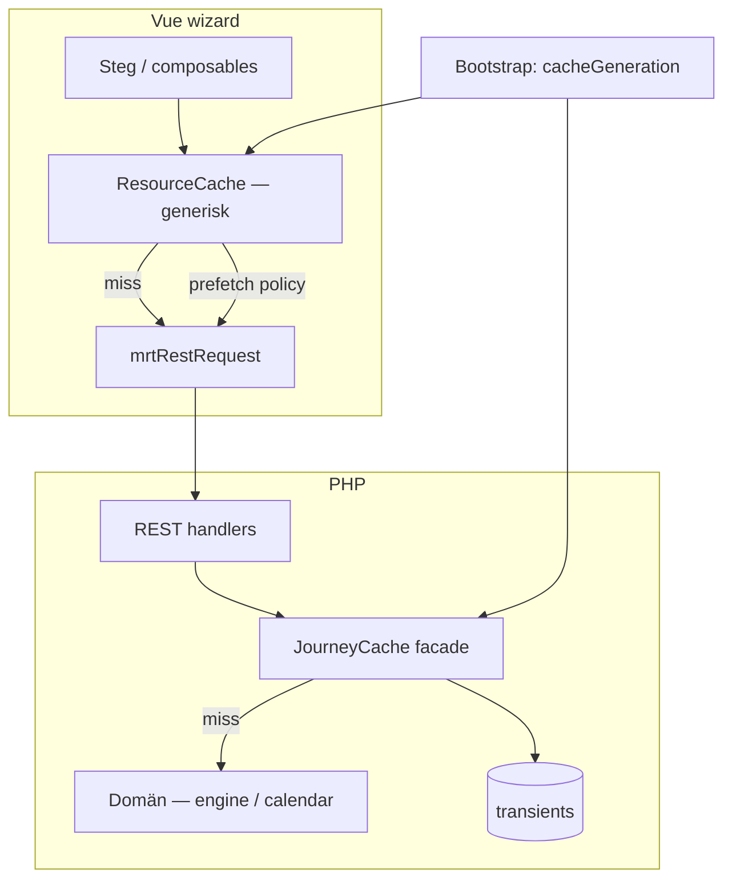

# Reseplanerare — holistisk cache-arkitektur (analys + refaktorförslag)

**Datum:** 2026-06-11  
**Utlöst av:** J14 — upplevd seghet, asymmetri single vs return, refresh beteende  
**Relaterat:** [WIZARD_PERFORMANCE_PLAN.md](WIZARD_PERFORMANCE_PLAN.md), [feedback/2026-06-11-jesper-reseplanerare.md](feedback/2026-06-11-jesper-reseplanerare.md)

---

## Sammanfattning

Idag finns **flera oberoende cache-lager** utan gemensam modell för nycklar, invalidering eller uppvärmning. Det fungerar för enstaka fall men leder till:

- asymmetri mellan resetyper (separata nycklar, ad hoc prefetch),
- cache som **inte överlever refresh** (klient),
- **kalla** serverberäkningar som fortfarande tar 4–8 s,
- svår felsökning (“är det Vue, transient eller kall PHP?”).

**Förslag:** Introducera en **generisk resurs-cache** på klient och server med **deklarativ nyckelmodell**, **gemensam cache-generation** och **policy-driven prefetch** — inte fler specialfall per resetyp.

---

## Nuläge — kartläggning

### Lager 0: Request-scope (PHP)

| Vad | Var | Livslängd |
|-----|-----|-----------|
| `$services_cache` per kalendermånad | `journey-calendar.php` | En HTTP-request |

**OK** — undviker upprepad `MRT_services_running_on_date()` inom samma månadsbuild.

### Lager 1: Server persistent (PHP transients)

| Resurs | Nyckel | TTL | Invalidering |
|--------|--------|-----|--------------|
| Kalendermånad | `ver \| from \| to \| year \| month \| trip_type` | 1 h | `MRT_bump_journey_calendar_cache_version()` |

**Fil:** `journey-calendar-cache.php`

**Saknas:**

- `journey/search` (per datum/resa),
- `journey/connection-detail`,
- `prices/trip`.

**Invalidering:** Version-bump vid `save_post` (alla plugin-CPT) och vissa options — **nuclear** (alla kalendertransients ogiltiga, gamla rader ligger kvar i DB).

### Lager 2: Klient session (Vue `Map`)

| Resurs | Modul | Nyckel | In-flight | Prefetch |
|--------|-------|--------|-----------|----------|
| Kalendermånad | `wizardCalendarCache.ts` | `from\|to\|tripType\|year\|month` | Ja (ny) | Ja — **endast** `single ↔ return` (specialfall) |
| Resesökning | `tripConnectionsCache.ts` | `leg\|from\|to\|date\|outboundArrival` | Nej | Nej |
| Priser | — | — | — | Nej |
| Detalj | — | — | — | Nej |

**Livslängd:** tills fliken stängs. **Refresh = tomt.**

### Lager 3: HTTP / browser

REST-svar: `Cache-Control: no-cache, must-revalidate` — **ingen** browser-cache av API (korrekt med nonce).

---

## Problem med nuvarande design

### 1. Fragmenterad modell

Tre separata implementationer (`wizardCalendarCache`, `tripConnectionsCache`, PHP transient) utan delad:

- nyckelformat,
- TTL-policy,
- invalideringssignal till klienten,
- prefetch-regler.

Varje ny resurs (priser, detalj) riskerar att kopiera samma mönster manuellt.

### 2. Ad hoc prefetch (single ↔ return)

Nuvarande fix i `wizardCalendarLoad.ts` löser **ett** symmetriproblem men:

- är hårdkodad till två resetyper,
- vet inte om `trip_type`-dimensionen för andra resurser,
- prefetchar inte granne-månader, parallella datum, etc.,
- duplicerar fetch-logik (egen `run()` utanför primär load).

**Princip:** Prefetch ska vara **policy**, inte inbäddad affärslogik i en composable.

### 3. Klient vs server asymmetri

| Scenario | PHP transient | Vue Map |
|----------|---------------|---------|
| Byta månad, samma session | Träff efter 1:a load | Träff |
| Refresh | Träff (om version oförändrad) | **Miss** |
| Byta resetyp | Separat nyckel | Separat nyckel |
| Admin sparar tidtabell | Version bump → miss | **Vet inte** — visar stale tills ny fetch |

Klienten har **ingen cache-generation** från server → kan inte invalidera session-cache när data ändras.

### 4. Kall beräkning fortfarande dyr

Cache **maskerar** upprepning; **ersätter inte** att:

- tur/retur-kalender kör full `MRT_journey_find_normalized_connections()` per dag,
- enkel resa kör BFS per dag (~4 s juli).

Optimering och cache är **komplementära**, inte alternativ.

### 5. Ingen enhetlig observability

Dev-logg finns för långsam kalender-build (PHP) och REST-timing (Vue), men ingen samlad vy: cache hit/miss/prefetch per resurs.

---

## Målbild — holistisk cache

### Principer

1. **Resurs-centrerad** — cachea *REST-svar* (eller domänresultat), inte ad hoc per skärm.
2. **Samma nyckel semantik** klient och server (kan serialiseras till samma sträng).
3. **Generation counter** — en synlig `cacheGeneration` i wizard bootstrap; klient rensar session-cache när den ändras.
4. **Deklarativ prefetch** — relaterade nycklar definieras i en tabell, inte i composables.
5. **Compute + store** — PHP ska fortfarande optimera kall väg; cache ska vara tunn wrapper.
6. **Stale-while-revalidate** (valfritt steg 2) — visa cachat direkt, uppdatera i bakgrunden.

### Resurstyper (förslag)

| `resource` | Parametrar | Server transient | Klient session | Prefetch-grannar |
|------------|------------|------------------|----------------|------------------|
| `calendar.month` | from, to, year, month, trip_type | Ja | Ja | ±1 månad, **alla trip_type för samma månad** |
| `journey.search` | from, to, date, trip_type, outbound_arrival? | Ja (fas 2) | Ja | — |
| `journey.detail` | service_id, from, to, date | Ja (fas 3) | Ja | övriga ben samma connection |
| `prices.trip` | from, to, trip_type, legs… | Ja (fas 3) | Ja | — |

---

## Föreslagen arkitektur



### A. PHP — `MRT_journey_cache_*` (facade)

**Ny fil:** `inc/domain/journey/journey-cache.php` (ersätter/ omsluter `journey-calendar-cache.php`)

```php
// Koncept — inte implementerat än

function MRT_journey_cache_generation(): int;

function MRT_journey_cache_key( string $resource, array $params ): string;

function MRT_journey_cache_get( string $resource, array $params ): ?array;

function MRT_journey_cache_set( string $resource, array $params, array $payload, ?int $ttl = null ): void;

function MRT_journey_cache_bump_generation( ?string $reason = null ): void;
```

**Anrop från domän:**

```php
function MRT_get_journey_calendar_month( ... ) {
  $params = [ 'from' => ..., 'trip_type' => ... ];
  $cached = MRT_journey_cache_get( 'calendar.month', $params );
  if ( $cached !== null ) {
    return $cached;
  }
  $built = MRT_build_journey_calendar_month( ... );
  MRT_journey_cache_set( 'calendar.month', $params, $built );
  return $built;
}
```

**Invalidering:** Behåll version-bump vid dataändring, men:

- exponera `cacheGeneration` i `MRT_vue_wizard_config()` (eller shared client config),
- logga `reason` i dev (`save_post`, `import`, `price_matrix`).

**TTL per resurs:** filter `mrt_journey_cache_ttl_{resource}` (default 1 h kalender, kortare för search om önskat).

### B. Vue — `createResourceCache<T>()`

**Ny modul:** `frontend/vue/src/wizard/cache/resourceCache.ts`

Ansvar:

- nyckel: `{ generation, resource, params }` → sträng,
- `get` / `set` / `has` / `clearIfGenerationStale`,
- `fetch(params, { priority: 'user' | 'prefetch' })` — dedupe **in-flight** per nyckel,
- valfritt `sessionStorage`-backed layer (steg 2).

**API:**

```ts
type CacheResource = 'calendar.month' | 'journey.search' | 'journey.detail' | 'prices.trip';

type FetchSpec<T> = {
  resource: CacheResource;
  params: Record<string, string | number>;
  request: () => Promise<T | null>;
};

function useWizardResourceCache(generation: Ref<number>) {
  return {
    load<T>(spec: FetchSpec<T>): Promise<T | null>,
    prefetchRelated(from: CacheResource, params: Record<string, string | number>): void,
  };
}
```

**Migrering:**

- `wizardCalendarCache.ts` + `tripConnectionsCache.ts` → tas bort; ersätts av en `Map` i `resourceCache`.
- `wizardCalendarLoad.ts` — ingen hårdkodad `otherWizardTripType`; anropar `prefetchRelated('calendar.month', params)`.

### C. Prefetch-policy (deklarativ)

**Ny fil:** `frontend/vue/src/wizard/cache/prefetchPolicy.ts`

```ts
export const WIZARD_PREFETCH_RELATED: Record<CacheResource, (params) => Array<{ resource; params }>> = {
  'calendar.month': (p) => {
    const related: Array<...> = [];
    const otherType = p.trip_type === 'return' ? 'single' : 'return';
    related.push({ resource: 'calendar.month', params: { ...p, trip_type: otherType } });
    // valfritt: föregående/nästa månad samma trip_type
    return related;
  },
  'journey.search': () => [],
  // ...
};
```

Policy kan senare flyttas till PHP/bootstrap JSON om produkt vill konfigurera utan deploy.

### D. Bootstrap — gemensam generation

**PHP** (`vue-shortcode-config.php` / `MRT_vue_shared_client_config`):

```php
'cacheGeneration' => MRT_journey_cache_generation(),
```

**Vue** (`createWizardStore` / app mount):

```ts
watch(() => config.cacheGeneration, (gen) => cache.clearIfGenerationStale(gen));
```

Efter admin-spar: nästa sidladdning får ny generation → klient rensar session-cache automatiskt (slut på “stale efter import” utan refresh av transient-only).

### E. HTTP (valfritt, fas 4)

För **publika, icke-personliga** GET-svar (t.ex. kalender om nonce flyttas till query):

- `Cache-Control: private, max-age=60` + `ETag` från cache-nyckel,
- **Låg prioritet** — generation + transient räcker initialt.

---

## Refaktorplan — faser

### Fas R1 — Enhetlig grund (liten risk)

| Steg | Arbete |
|------|--------|
| R1.1 | PHP: `journey-cache.php` facad; migrera kalender från `journey-calendar-cache.php` |
| R1.2 | Exponera `cacheGeneration` i wizard-config |
| R1.3 | Vue: `createResourceCache` + migrera kalender + resesökning |
| R1.4 | Flytta prefetch till `prefetchPolicy.ts`; ta bort specialfunktioner i `wizardCalendarLoad.ts` |
| R1.5 | Tester: PHP `JourneyCalendarCacheTest` → `JourneyCacheTest`; Vue `resourceCache.test.ts` |

**Leverans:** Samma beteende som idag, renare struktur, generation på klient.

### Fas R2 — Utöka server-cache

| Steg | Arbete |
|------|--------|
| R2.1 | `journey/search` via `MRT_journey_cache_*` |
| R2.2 | Ev. per-dag bool-cache internt i kalender-build (delas mellan single/return där möjligt) |

**Leverans:** Refresh + ny session snabbare även för utresa-steg.

### Fas R3 — Persistens + SWR

| Steg | Arbete |
|------|--------|
| R3.1 | `sessionStorage` med `{ generation, resource, params, data, ts }` |
| R3.2 | Stale-while-revalidate: visa cache, fetch i bakgrund, uppdatera UI |
| R3.3 | Dev overlay: cache hit/miss/prefetch (utöka `mrtRestTiming`) |

### Fas R4 — Domänoptimering (parallellt med R1–R2)

| Steg | Arbete |
|------|--------|
| R4.1 | `MRT_journey_calendar_has_round_trip_fast()` — progressiv, ingen full lista utresor |
| R4.2 | Dela dag-resultat mellan trip_type där logik tillåter (t.ex. `none` / trafik finns) |

**Mål:** Kall kalender juli tur/retur **&lt; 2 s** även utan transient.

---

## Vad vi **inte** bör göra

- **Fler specialfall** (`prefetchSingleIfReturn`, etc.) per resurs.
- **Dubbel sanning** — nycklar definierade på två ställen utan gemensam helper.
- **Ersätta domänoptimering** med aggressiv prefetch (fler anrop, samma kalla PHP).
- **localStorage** för stora kalenderpayloads utan generation — risk stale data.

---

## Beslutspunkter (produkt/teknik)

| # | Fråga | Rekommendation |
|---|-------|----------------|
| D1 | SessionStorage för kalender över refresh? | Ja, i R3 — med `cacheGeneration` |
| D2 | Server-cache för `journey/search`? | Ja, R2 — samma facad |
| D3 | Prefetch granne-månader? | Ja, i policy — låg prioritet efter resetyp |
| D4 | En global `mrt_journey_cache_generation` vs per-resurs? | **Global** (enklare, nuvarande modell) |
| D5 | Behålla nuvarande prefetch tills R1 klar? | Ja — eller revert om R1 påbörjas direkt |

---

## Nästa steg

1. **Godkänn målbild** (detta dokument) — ev. justera faser.
2. **Implementera R1** — generisk facad + Vue `ResourceCache`; ta bort duplicerade Maps.
3. **Parallellt R4.1** — största användarvinsten för första besök.
4. Uppdatera [WIZARD_PERFORMANCE_PLAN.md](WIZARD_PERFORMANCE_PLAN.md) när R1 levererad.

---

## Bilaga — nuvarande vs föreslagen filstruktur

```
inc/domain/journey/
  journey-cache.php              ← NY facad
  journey-calendar-cache.php     ← deprecate / thin wrapper
  journey-calendar.php           ← använder facad

frontend/vue/src/wizard/
  cache/
    resourceCache.ts             ← NY generisk klient-cache
    prefetchPolicy.ts            ← NY deklarativ prefetch
    cacheKeys.ts                 ← NY delade nyckelbyggare
  composables/
    wizardCalendarLoad.ts        ← tunn; anropar resourceCache
    useTripConnections.ts        ← tunn; anropar resourceCache
  utils/
    wizardCalendarCache.ts       ← TA BORT efter migrering
    tripConnectionsCache.ts      ← TA BORT efter migrering
```
