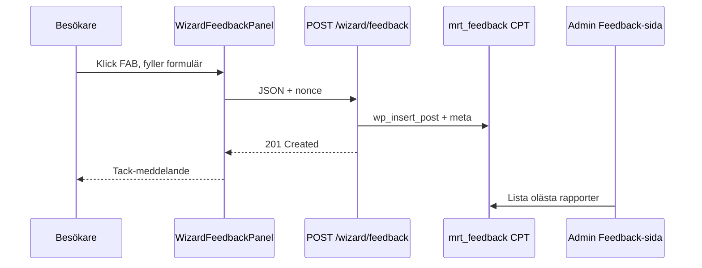

# Skiss — feedback i reseplaneraren

**Status:** v1 implementerad (2026-06-10); v2 kvar: e-postnotis  
**Relaterat:** [2026-06-09-jesper-beta.md](feedback/2026-06-09-jesper-beta.md) (J13, D2), beta-banner (admin: `wizard_beta_enabled`), [TODO.md](TODO.md)

## Mål

Besökare ska kunna rapportera buggar och lämna förslag **utan att lämna sidan**. Rapporterna sparas i WordPress och kan granskas i admin — inte via extern mailto-länk.

Beta-bannern (informationsrad) och feedback-widgeten (insamling) är **två separata saker**:

| Funktion | Styrning (admin) | Syfte |
|----------|------------------|-------|
| Beta-banner | Inställningar → *Visa beta-banner* | Sätter förväntningar ("testas under säsongen") |
| Feedback-widget | Inställningar → *Aktivera feedback* (föreslagen) | Samlar in rapporter |

---

## UI-skiss

### 1. Flytande knapp (FAB)

```
┌─────────────────────────────────────────────┐
│  [Beta] Reseplaneraren testas…              │
│  ┌─ Steg 1 ─┬─ Steg 2 ─┬─ Steg 3 ─┐         │
│  │           panelinnehåll           │         │
│  └───────────────────────────────────┘         │
│                                    ┌───┐     │
│                                    │ 🐛 │ ← FAB
│                                    └───┘     │
└─────────────────────────────────────────────┘
```

- **Position:** nederst till höger i `.mrt-journey-wizard`, `position: fixed` inom wizard-root (inte hela WP-sidan om inbäddad).
- **Ikon:** liten bugg/rapport-ikon (SVG, `.mrt-icon`), inte emoji i produktion.
- **Etikett:** `aria-label="Rapportera fel eller förslag"`, synlig text vid hover/fokus (valfritt).
- **Synlighet:** endast när `wizard_feedback_enabled` är på i admin (oberoende av beta-banner).

### 2. Panel / modal vid klick

```
┌──────────────────────────────────┐
│  Rapportera fel eller förslag  ✕ │
├──────────────────────────────────┤
│  Typ                             │
│  ( ) Fel / bugg   ( ) Förslag    │
│                                  │
│  Beskrivning *                   │
│  ┌────────────────────────────┐  │
│  │                            │  │
│  └────────────────────────────┘  │
│                                  │
│  E-post (valfritt)               │
│  ┌────────────────────────────┐  │
│  └────────────────────────────┘  │
│                                  │
│  Vi sparar din rapport för       │
│  felsökning. E-post används bara │
│  om du fyller i den.             │
│                                  │
│  [ Avbryt ]     [ Skicka ]       │
└──────────────────────────────────┘
```

- **Mobil:** panel glider upp från botten (bottom sheet), full bredd.
- **Desktop:** centrerad dialog ~24rem, fokusfälla + Escape stänger.
- **Efter skickat:** kort bekräftelse ("Tack! Vi har tagit emot din rapport.") — panel stängs efter ~2 s.
- **GDPR-text:** visas i panelen (beslutat) — *"Vi sparar din rapport för felsökning. E-post används bara om du fyller i den."*
- **E-post:** valfritt (beslutat).

### 3. Automatisk kontext (sparas, visas inte för användaren)

| Fält | Källa |
|------|-------|
| `page_url` | `window.location.href` |
| `wizard_step` | aktuellt steg (`route` / `date` / …) |
| `user_agent` | server-side från request |
| `created_at` | server timestamp |
| `route_snapshot` | valda stationer/datum om tillgängligt (JSON) |

---

## Admin

### Inställningar (föreslagen)

Ny rad under beta-banner i **Inställningar**:

- **Aktivera feedback i reseplaneraren** — checkbox `wizard_feedback_enabled`
- Hint: *"Visar en flytande rapportknapp. Rapporter sparas under Feedback i menyn."*

### Lista i admin (ny vy)

**Meny:** Tidtabell → **Feedback** (eller under Dashboard)

| Datum | Typ | Beskrivning (förhandsvisning) | Steg | Status |
|-------|-----|-------------------------------|------|--------|
| 2026-06-10 14:32 | Fel | "Priset stämmer inte…" | summary | Ny |

- Klick → detaljvy med full text, kontext, ev. e-post.
- Åtgärder: Markera som *Läst*, *Åtgärdad*, *Avvisad* (enkel status, inget ärendesystem i v1).

---

## Teknik (föreslagen)

### Lagring

**Custom post type** `mrt_feedback` (private, ingen frontend-arkiv):

- `post_title` — auto: `"Fel — 2026-06-10 14:32"` eller första 60 tecken
- `post_content` — beskrivning
- Meta: `mrt_feedback_type`, `mrt_feedback_email`, `mrt_feedback_page_url`, `mrt_feedback_wizard_step`, `mrt_feedback_context` (JSON), `mrt_feedback_status`

Alternativ: egen tabell — CPT räcker för förväntad volym (säsong, låg trafik).

### REST

```
POST /wp-json/mrt/v1/wizard/feedback
```

Body:

```json
{
  "type": "bug",
  "message": "…",
  "email": "valfritt@example.se",
  "wizardStep": "summary",
  "context": { "fromStationId": 1, "toStationId": 2 }
}
```

- **Permission:** `MRT_rest_can_read_public` + nonce (samma mönster som journey search).
- **Rate limit:** t.ex. max 5/min per IP (transient), honeypot-fält mot spam.
- **Validering:** `message` min 10 tecken, max 2000; `type` ∈ `bug|suggestion`.

Admin:

```
GET  /mrt/v1/feedback          — lista (manage_options)
GET  /mrt/v1/feedback/export   — CSV (manage_options)
GET  /mrt/v1/feedback/{id}     — detalj
PATCH /mrt/v1/feedback/{id}    — status
```

### Vue

| Fil | Roll |
|-----|------|
| `WizardFeedbackFab.vue` | Flytande knapp |
| `WizardFeedbackPanel.vue` | Formulär + submit |
| `useWizardFeedback.ts` | POST + tillstånd |
| `journey-wizard/feedback.css` | FAB + panel |

Monteras i `JourneyWizardApp.vue` när `config.feedbackEnabled === true`.

PHP skickar `feedbackEnabled` från `MRT_plugin_wizard_feedback_enabled()` (spegel av admin-inställning).

---

## Flöde



---

## Beslut (2026-06-10)

| # | Fråga | Beslut |
|---|-------|--------|
| 1 | Ska feedback-knappen visas utan beta-banner? | **Ja** — oberoende admin-toggles (`wizard_beta_enabled` / `wizard_feedback_enabled`) |
| 2 | E-post obligatorisk? | **Nej** — valfritt fält |
| 3 | Notifiering till team vid ny rapport? | **Framtida utveckling** (v2) — `wp_mail` till konfigurerbar adress |
| 4 | GDPR-text i panelen? | **Ja** — se formulärskiss ovan |

---

## Implementationsordning

1. Admin: `wizard_feedback_enabled` + REST lagring (CPT + POST)
2. Vue: FAB + panel + submit (inkl. GDPR-text)
3. Admin: Feedback-lista (status: Ny / Läst / Åtgärdad / Avvisad)
4. **Framtida utveckling:** e-postnotis vid ny rapport
