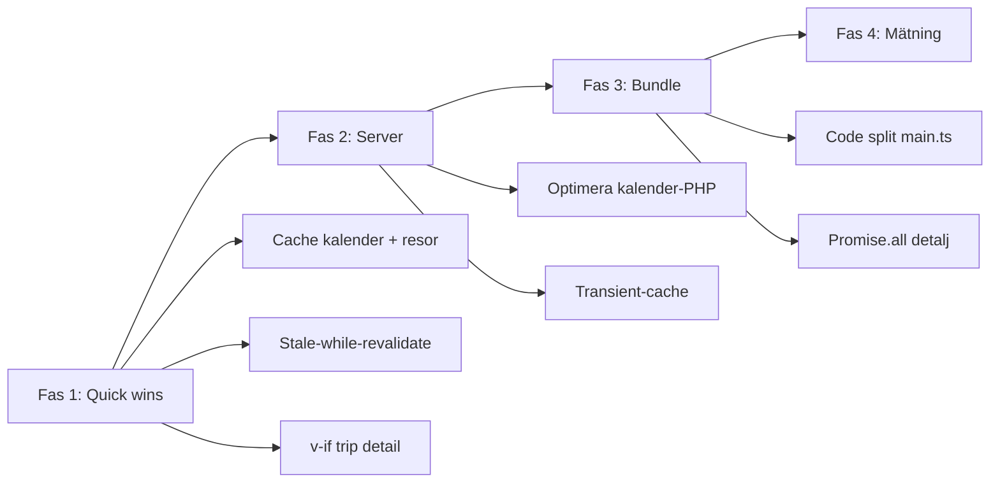

# Åtgärdsplan – reseplanerare (prestanda)

Upplevd långsamhet i wizard (juni 2026). Planen täcker identifierade flaskhalsar, befintliga optimeringar och prioriterade åtgärder i tre faser.

**Relaterat:** [VUE_FRONTEND.md](VUE_FRONTEND.md), [REST_API.md](REST_API.md), [SHORTCODES.md](SHORTCODES.md), [feedback/2026-06-05-reseplanerare-beta.md](feedback/2026-06-05-reseplanerare-beta.md)

---

## Sammanfattning

| Område | Rotorsak | Prioritet |
|--------|----------|-----------|
| Kalender-API | Upp till 31 resesökningar per månad (tur/retur värre) | Hög |
| Klient-refetch | Steg förstörs (`v-if`) och data hämtas om vid tillbaka | Hög — **åtgärdat** (fas 1) |
| Bundle | Monolitisk bundle laddade alla fyra Vue-appar | Medium — **åtgärdat** (fas 3: ES modules + lazy chunks) |
| Rendering | Många trip-kort med dold detaljkomponent | Låg–medium — delvis (parallell detaljhämtning, fas 3) |

**Kvar:** Fas 4 (mätning och underhåll). Fas 2 v1 = transient-cache per månad (`journey-calendar-cache.php`).

---

## Status

| Fas | Beskrivning | Status |
|-----|-------------|--------|
| 0 | Diagnostik och plan (detta dokument) | Klar |
| 1 | Quick wins – client-cache, mindre refetch | Klar (juni 2026) |
| 2 | Server – optimera kalendermånad | **Klar** (transient-cache, juni 2026) |
| 3 | Bundle-splitting, parallell detaljhämtning | Klar (juni 2026) |
| 4 | Mätning och underhåll | Ej påbörjad |

---

## Arkitektur (nuvarande)

```
WordPress shortcode
  → inc/public/journey-wizard/shell.php
  → inc/public/vue-shortcode-config.php (inline JSON)
  → assets/dist/vue/ (ES module entry + lazy app-chunks)
  → frontend/vue/src/main.ts
  → JourneyWizardApp.vue
       → steg via v-if: route → date → outbound → (return) → summary
       → createWizardStore() (reactive, ingen Pinia)
```

### API-anrop per steg

| Steg | Klient | REST-action | PHP |
|------|--------|-------------|-----|
| Datum | `wizardCalendarLoad.ts` | `POST journey/calendar` | `MRT_get_journey_calendar_month()` |
| Utresa / återresa | `useTripConnections.ts` | `POST journey/search` | `MRT_journey_search_response()` |
| Detalj (expand) | `connectionDetailLoad.ts` | `POST journey/connection-detail` | parallellt per ben (`Promise.all`) |
| Sammanfattning | `useTripPrices()` | `GET prices/trip` | prissökning |

### Bundle (nu)

- `frontend/vue/vite.config.ts`: format `es`, lazy chunks per app
- `frontend/vue/src/main.ts`: dynamisk `import()` per `data-mrt-vue-app`
- Publik JS entry: ~67 KiB (`assets/main-*.js`) + lazy app-chunk (t.ex. wizard ~57 KiB) + delad vendor i entry
- WordPress: `wp_script_add_data( …, 'type', 'module' )` i `inc/assets/vue-frontend.php`
- CSS per chunk i manifest (Vite injicerar chunk-CSS vid lazy load)

---

## Identifierade flaskhalsar

### 1. Server – kalendermånad (störst påverkan)

`inc/domain/journey/journey-calendar.php` — `MRT_get_journey_calendar_month()` loopar varje dag i månaden:

```php
for ( $d = 1; $d <= $days; $d++ ) {
    $out[ $ymd ] = MRT_journey_calendar_day_entry( ... );
}
```

Per dag:

- **Enkel resa:** `MRT_journey_engine_has_connection()` (progressiv BFS)
- **Tur/retur:** `MRT_journey_calendar_has_round_trip()` — full utressökning + retursökning per kandidat

Körs vid varje kalenderladdning och månadsskifte. Ingen HTTP-cache eller månads-cache på servern utöver `$services_cache` inom samma request.

### 2. Klient – redundant refetch

**Kalender** — `useWizardCalendar.ts` watch på `store.step`:

```ts
if (s === 'date' && store.calYear) {
  void loadWizardCalendarMonth(...); // ingen cache-koll
}
```

**Reselista** — `WizardTripStep.vue` remountas (`v-if`) och refetchar:

```ts
onMounted(() => void loadConnections());
watch(() => store.step, (s) => { if (s === props.legCtx) void loadConnections(); });
```

`useTripConnections.ts` tömmer listan innan ny data:

```ts
connections.value = []; // ger "Laddar…"-blink
```

### 3. Monolitisk bundle (åtgärdat, fas 3)

Tidigare laddades alla publika Vue-appar på wizard-sidor. Nu: `format: 'es'`, dynamisk `import()` per `data-mrt-vue-app`, `type="module"` i WordPress. Se § Bundle (nu) ovan.

### 4. Rendering

| Hotspot | Fil | Problem |
|---------|-----|---------|
| N trip-kort × detalj | `WizardTripCard.vue` | `WizardTripDetail` mountas med `v-show` (dold men i DOM) |
| Kalenderceller | `WizardCalendarGrid.vue` | `asDay(cell)` anropas flera gånger per cell |
| Detalj per ben | `connectionDetailLoad.ts` | Sekventiell `await` i `for`-loop |
| Store-getters | `wizardStoreState.ts` | `stepLabels`, `contextLine` byggs om vid varje access |

---

## Befintliga optimeringar

| Optimering | Var |
|------------|-----|
| Detalj lazy (vid expand) | `WizardTripCard.toggleDetail()` → `ensureLoaded()` |
| Detalj hämtas en gång | `useConnectionDetail.ts` — `if (loaded.value) return` |
| Progressiv sökning (single, kalender) | `MRT_journey_engine_has_connection()` |
| Services-cache per request | `$services_cache` i `journey-calendar.php` |
| Debug mock utan nätverk | `useTripConnections`, `wizardCalendarLoad` |
| `decoding="async"` på ikoner | `MrtVehicleRow.vue` |
| Inaktiva steg ej i DOM | `v-if` i `JourneyWizardApp.vue` (spar minne, kostar remount) |
| Reduced motion | `journey-wizard/base.css` |

**Saknas i wizard:** client-side response-cache, `keep-alive`, `defineAsyncComponent`, debounce/throttle, `AbortController`, `v-memo`, virtual scrolling, runtime-mätning.

---

## Fas 1 – Quick wins (klient)

**Mål:** Märkbar förbättring vid tillbaka-navigering utan PHP-ändringar.

**Uppskattad effort:** 1–2 dagar.

### 1.1 Client-cache kalendermånad

- **Nyckel:** `fromId|toId|tripType|year|month`
- **Var:** `wizardCalendarLoad.ts`, ev. modul `wizardCalendarCache.ts`
- **Beteende:** Returnera cachad `daysMap` om nyckeln matchar; skriv till cache efter lyckat API-svar
- **Watch:** Ta bort eller begränsa refetch i `useWizardCalendar.ts` — refetch bara om route/tripType ändrats eller cache saknas

### 1.2 Client-cache resesökning

- **Nyckel:** `legCtx|from|to|dateYmd|outbound_arrival` (sista fältet bara för return)
- **Var:** `useTripConnections.ts`, ev. hoista till `wizardStoreState.ts` eller separat cache-modul
- **Beteende:**
  - Visa cachad lista direkt (stale-while-revalidate)
  - Töm inte `connections` före ny data — visa overlay/spinner ovanpå befintlig lista
- **Alternativ:** `<keep-alive>` runt steg i `JourneyWizardApp.vue` (behåll komponent + state)

### 1.3 Lazy-mount trip-detalj

- **Var:** `WizardTripCard.vue`
- **Ändring:** `v-if="expanded"` istället för `v-show` på `WizardTripDetail`
- **Effekt:** Färre composable-instanser när många connections returneras

### 1.4 Avbryt in-flight requests (valfritt i Fas 1)

- **Var:** `mrtRest.ts`, `wizardCalendarLoad.ts`
- **Ändring:** `AbortController` per pågående anrop; debounce snabba månadsklick

### Verifiering Fas 1

- [ ] Tillbaka från utresa till datum — ingen ny kalender-API om samma månad
- [ ] Tillbaka från summary till utresa — lista visas direkt
- [ ] Byt station/rutt — cache invalideras korrekt (ny cache-nyckel)
- [x] Enhetstester: `wizardCalendarLoad.test.ts`, `useTripConnections.test.ts`
- [ ] `.\scripts\vue-check.ps1` grönt (befintliga typecheck-fel i andra filer)
- [ ] Manuell rökning: [SMOKE_CHECKLIST.md](SMOKE_CHECKLIST.md)

### Senast klart (Fas 1)

| Åtgärd | Filer |
|--------|-------|
| Kalender-cache | `wizard/utils/wizardCalendarCache.ts`, `composables/wizardCalendarLoad.ts` |
| Res-cache | `wizard/utils/tripConnectionsCache.ts`, `composables/useTripConnections.ts` |
| Ingen list-tömning vid refetch | `useTripConnections.ts`, `WizardTripStep.vue` (`loading && !connections.length`) |
| Lazy trip-detalj | `WizardTripCard.vue` (`v-if` + `nextTick` före `ensureLoaded`) |

Cache invalideras implicit via nyckel (station, rutt, datum, tur/retur) — ingen explicit `clear` vid `setRoute`.

---

## Fas 2 – Server (kalendermånad)

**Mål:** Snabbare första laddning och månadsskifte.

**Uppskattad effort:** 3–5 dagar (beroende på vald strategi).

### 2.1 Alternativ (välj en eller kombinera)

| Strategi | Beskrivning | Effort | Risk |
|----------|-------------|--------|------|
| Transient-cache | `set_transient` per `from|to|tripType|year|month`, TTL t.ex. 1 h | Låg | Cache-invalidering vid tidtabellsändring |
| Månads-batch | Förberäkna graf/tjänster en gång per månad, återanvänd för alla dagar | Medium | Kräver engine-förståelse |
| Tur/retur-förenkling | Tidig avbrytning / lättare heuristik innan full `MRT_journey_find_normalized_connections` | Medium | Korrekthet måste verifieras med tester |
| HTTP-cache headers | `Cache-Control` på `mrt_journey_calendar_month` för CDN/browser | Låg | Begränsad nytta utan stabil cache-nyckel |

### 2.2 Filer

- `inc/domain/journey/journey-calendar.php` — `MRT_get_journey_calendar_month()`, `MRT_journey_calendar_has_round_trip()`
- `inc/domain/journey/engine/search.php`
- Nya/enhetstester i `tests/Unit/` eller befintliga journey-tester

### 2.3 Cache-invalidering

Vid import, sparande av tidtabell eller tjänst — rensa relevanta transients (hook vid `save_post` / import-complete).

### Verifiering Fas 2

- [ ] PHPUnit: befintliga journey/calendar-tester gröna
- [ ] Nytt test: samma kalenderoutput före/efter optimering
- [ ] Mät REST-latens för `mrt_journey_calendar_month` (single + return) före/efter
- [ ] `.\scripts\check.ps1` grönt

---

## Fas 3 – Bundle och detaljer

**Mål:** Snabbare initial sidladdning och snabbare expand av byte-resor.

**Uppskattad effort:** 2–4 dagar.

### 3.1 Code splitting per Vue-app

- **Var:**
  - `frontend/vue/vite.config.ts` — ta bort `inlineDynamicImports: true`
  - `frontend/vue/src/main.ts` — dynamisk `import()` per `data-mrt-vue-app`
  - `scripts/verify-build.mjs` — uppdatera förväntningar (flera chunks)
  - `inc/assets/vue-frontend.php` — ev. flera script-taggar från manifest
  - `docs/SHORTCODES.md` — korrigera async-chunk-beskrivning

### 3.2 Parallell detaljhämtning

- **Var:** `connectionDetailLoad.ts`
- **Ändring:** `Promise.all(legs.map(...))` istället för sekventiell `for`-loop

### 3.3 Mindre rendering (backlog)

- Memoize `stepLabels` / `contextLine` i `wizardStoreState.ts`
- `WizardCalendarGrid.vue` — bind `asDay(cell)` en gång per cell
- Prefetch `GET prices/trip` vid val av utresa/återresa (`wizardSelections.ts`)

### Verifiering Fas 3

- [x] Wizard-sida laddar endast wizard-chunk (+ shared entry)
- [x] `npm run verify` / `.\scripts\vue-check.ps1` grönt
- [ ] Expand av 2+ ben: märkbart snabbare (jämför nätverk-fliken)

### Senast klart (Fas 3)

- ES module entry + lazy `import()` per app i `main.ts`
- `connectionDetailLoad.ts` — parallell `Promise.all` för flerbeniga detaljer
- `verify-build.mjs`, e2e serve (`type="module"`), PHP enqueue uppdaterade

---

## Fas 4 – Mätning och underhåll

**Mål:** Data-driven optimering framåt; undvik gissning.

### 4.1 Dev-timing (minimal)

Logga i dev-läge (bakom flagga):

- REST-action, duration ms, payload-nyckel (utan PII)
- Steg-byte → tid till interaktivt UI

**Var:** wrapper runt `mrtRestRequest()` i `frontend/vue/src/api/mrtRest.ts`

### 4.2 Prod (valfritt)

- Web Vitals eller enkel custom metric (t.ex. Sentry transaction per wizard-steg)
- Server-side: logga långsamma `mrt_journey_calendar_month` (> N ms)

### 4.3 Dokumentation

- Uppdatera `VUE_FRONTEND.md` med faktisk bundle-strategi efter Fas 3
- Bocka av status-tabellen i detta dokument när faser slutförs

---

## Prioriteringsmatris

| # | Åtgärd | Impact | Effort | Fas |
|---|--------|--------|--------|-----|
| 1 | Client-cache kalendermånad | Hög | Låg | 1 |
| 2 | Client-cache resesökning + stale UI | Hög | Låg | 1 |
| 3 | `v-if` på trip-detalj | Medium | Låg | 1 |
| 4 | Server kalendermånad-optimering | Hög | Medium–hög | 2 |
| 5 | Transient-cache kalender | Hög | Låg–medium | 2 |
| 6 | Code split per app | Medium | Medium | 3 |
| 7 | Parallell detaljhämtning | Medium | Låg | 3 |
| 8 | AbortController + debounce | Låg–medium | Låg | 1/4 |
| 9 | Prefetch priser | Låg–medium | Låg | 3 |
| 10 | Font preload / self-host | Låg | Låg | backlog |

---

## Flöde (rekommenderad implementation)



---

## Backlog (lägre prioritet)

- Self-host eller preload Google Fonts (`assets/mrt-typography.css`)
- Virtual scrolling om reselistor blir mycket långa (>50 connections)
- `keep-alive` som alternativ till explicit cache-modul
- Gzip/brotli-storlek i `verify-build` (idag bara rå KiB)

---

## Anteckningar

- `docs/STYLE_GUIDE.md`: "Undvik premature optimization" — denna plan motiveras av upplevd långsamhet i beta, inte spekulativ mikro-optimering.
- Admin Vue (`admin.js`, ~253 KiB) påverkas inte av wizard-planen.
- Ingen ändring av REST-kontrakt krävs för Fas 1; Fas 2 kan lägga till cache-headers men bör behålla samma JSON-form.
